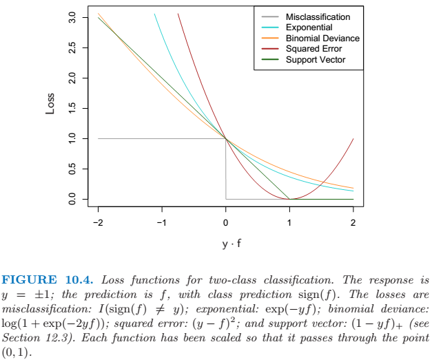
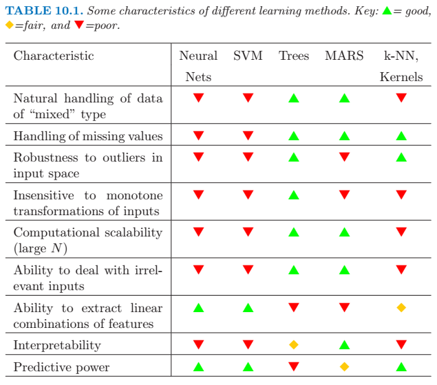
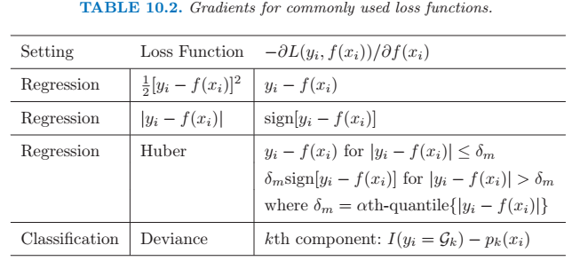

## Boosting and Additive Trees
 
### Boosting Methods
 
#### AdaBoost.M1. (Discrete AdaBoost)
 
Consider a two-class problem, with the output variable coded as \\(Y \in \{ -1, 1 \} \\).
 
A weak classifier is one whose error rate is only slightly better than random guessing.
 
The purpose of boosting is to sequentially apply the weak classification algorithm to repeatedly modified versions of the data, thereby producing a sequence of weak classifiers. The predictions from all of them are then combined through a weighted majority vote to produce the final prediction.
 
The data modifications at each boosting step consist of applying weights \\(w_1, w_2, ..., w_N\\) to each of the training observations \\((x_i, y_i)\\), \\(i=1,2,...,N\\). Initially all of the weights are set to a same value. At step \\(m\\), those observations that were misclassified by the classifier \\(G_{m-1} (x)\\) induced at the previous step have their weights increased, whereas the weights are decreased for those that were classified correctly.
 
Algorithm details :
 
1\. Initialize the observation weights \\(w_i = 1 / N\\), \\(i=1,2,...,N\\).
 
2\. For \\(m=1\\) to \\(M\\) :
 
2\.1) Fit a classifier \\(G_m(x)\\) to the training data using weights \\(w_i\\).
 
2\.2) Compute \\[ \mathrm{err}_m = \frac {\sum^N_{i=1} w_i I(y_i \neq G_m(x_i))} {\sum^N_{i=1} w_i} \\]
 
 
2\.3) Compute \\(\alpha_m = \log{((1 - \mathrm{err}_m)/ \mathrm{err}_m)} \\)
 
2\.4) Set \\(w_i \gets w_i \cdot \operatorname{exp} [\alpha_m \cdot I(y_i \neq G_m(x_i))]\\), \\(i=1,2,...,N\\).
 
3\. Output \\(G(x) = \operatorname{sign} \left [ \sum^M_{m=1} \alpha_m G_m(x) \right ] \\).
 
Based on the equation above, boosting is actually fitting an additive model.
 
### Boosting Fits an Additive Model
 
Generally, basis function expansions take the form
\\[ f(x) = \sum^M_{m=1} \beta_m b(x; \; \gamma_m) \\]
 
Typically these models are fit by minimizing a loss function averaged over the training data.
\\[ \underset{\{ \beta_m, \gamma_m \}^M_1 }{\operatorname{min}} \sum^N_{i=1} L \left ( y_i, \sum^M_{m=1} \beta_m b(x_i; \; \gamma_m) \right ) \\]
 
### Forward Stagewise Additive Modeling
 
Foward stagewise additive modeling continously adds new basis functions to the expansion without adjusting the parameters and coefficients of those that have already been added.
 
Algorithm details:
 
1. Initialize \\(f_0(x) = 0\\).
 
2. For \\(m=1\\) to \\(M\\) :
 
    1. Compute \\[ (\beta_m, \gamma_m) = \underset{\beta, \gamma} {\operatorname{arg\, min}} \sum^N_{i=1} L(y_i, f_{m-1} (x_i) + \beta b(x_i; \, \gamma))\\]
 
    2. Set \\(f_m(x) = f_{m-1}(x) + \beta_m b(x; \, \gamma_m)\\).
 
### Exponential Loss and AdaBoost
 
AdaBoost.M1 is equivalent to forward stagewise additive modeling, if using the loss function
\\[L(y, f(x)) = \exp (-y\, f(x))\\]
 
In other words, AdaBoost.M1 minimizes the exponential loss criterion via a forward stagewise additive modeling approach.
 
### Loss Functions and Robustness
 

 
### Data Mining Methods Comparison
 

 
### Boosting Trees
 
A tree can be formally expressed as
\\[ T(x;\, \Theta) = \sum^J_{j=1} \gamma_j I(x \in R_j)\\]
with parameters \\(\Theta = \{ R_j, \gamma_j \}^J_1 \\). The parameters are found by minimizing the empirical risk
\\[ \hat{\Theta} = \mathrm{arg}\,\underset{\Theta}{\operatorname{min}} \sum^J_{j=1} \sum_{x_i \in R_j} L(y_i, \gamma_j)\\]
 
It is necessary to divide the optimization problem into two parts:

- Finding \\(\gamma_j\\) given \\(R_j\\): This is typical trivial.
- Finding \\(R_j\\): Difficult, approximate solutions are found.
 
The boosted tree model is a sum of such trees,
\\[ f_M(x) = \sum^M_{m=1} T(x; \, \Theta_m) \\]
induced in a forward stagewise manner. At each step in the forward stagewise procedure one must solve
\\[\hat{\Theta}_m = \operatorname{arg} \underset{\Theta_m}{\operatorname{min}} \sum^N_{i=1} L(y_i,\, f_{m-1}(x_i) + T(x_i;\, \Theta_m)) \\]
 
### Gradient Boosting
 
#### Steepest Descent
 
To solve the problem of finding \\(\hat{\mathbf{f}} = \operatorname{arg} \underset{\mathbf{f}}{\operatorname{min}} L(\mathbf{f}) \\), it can be achieved by solving as a sum of component vectors
\\[ \mathbf{f}_M = \sum^M_{m=0} \mathbf{h}_m, \;\;\; \mathbf{h}_m \in \mathbb{R}^N\\]
where \\(\mathbf{f}_0 = \mathbf{h}_0 \\) is an initial guess, and each successive \\(\mathbf{f}_m\\) is induced based on the current parameter vector \\(\mathbf{f}_{m-1}\\), which is the sum of the previously induced updates. The increment vector \\(\mathbf{h}_m\\) is called *step*.
 
Steepest descent chooses \\(\mathbf{h}_m = - \rho_m \mathbf{g}_m\\) where \\(\rho_m\\) is a scalar and \\(\mathbf{g}_m \in \mathbb{R}^N\\) is the gradient of \\(L(\mathbf{f})\\) evaluated at \\(\mathbf{f}_{m-1}\\).
\\[ g_{im} = \left [ \frac{\partial L(y_i, f(x_i))} {\partial f(x_i)} \right ]_{f(x_i) = f_{m-1}(x_i)} \\]
\\[ \rho_m = \operatorname{arg} \underset{\rho}{\operatorname{min}} L(\mathbf{f}_{m-1} - \rho \mathbf{g}_m) \\]
\\[ \mathbf{f}_m = \mathbf{f}_{m-1} - \rho_m \mathbf{g}_m \\]
 
#### Gradient Boosting with Trees
 
A approximation solution to the steepest descent gradient is to build a tree to predict the negative gradient as close as possible.
 

 
For classification the loss function is the multinomial deviance, and \\(K\\) least squares trees are constructed at each iteration.
 
#### Implementations of Gradient Boosting
 
1\. Initialize \\(f_0(x) = \operatorname{arg\, min}_\gamma \sum^N_{i=1} L(y_i, \gamma) \\).
 
2\. For \\(m=1\\) to \\(M\\) :
 
2\.1) For \\(i=1,2,...,N\\) compute
\\[ r_{im} = - \left [ \frac {\partial L(y_i, f(x_i))} {\partial f(x_i)} \right ]_{f=f_{m-1}} \\]
 
2\.2) Fit a regression tree to the targets \\(r_{im}\\) giving terminal regions \\(R_{jm}\\), \\(j=1,2,..,J_m\\).
 
2\.3) For \\(j=1,2,...,J_m\\) compute
\\[ \gamma_{jm} = \operatorname{arg} \underset{\gamma}{\operatorname{min}} \sum_{x_i \in R_{jm}} L(y_i, f_{m-1}(x_i) + \gamma) \\]
 
2\.4) Update \\(f_m(x) = f_{m-1}(x) + \sum^{J_m}_{j=1} \gamma_{jm} I(x \in R_{jm}) \\).
 
3\. Output \\(\hat{f}(x) = f_M(x) \\).
 
For classification, Lines 2.1 - 2.4 are repeated \\(K\\) time at each iteration \\(m\\).
 
### Right-Sized Trees for Boosting
 
The variable-variable interaction level of tree-based approximations is limited by the tree size \\(J\\). Namely, no interaction effects of level greater than \\(J-1\\) are possible.
 
Setting \\(J = 2\\) (single split "decision stump") produces boosted models with only main effects; no interactions are permitted. With \\(J = 3\\), two-variable interaction effects are also allowed.
 
Although in many applications \\(J = 2\\) will be insufficient, it is unlikely that \\(J > 10\\) will be required. Experience so far indicates that \\(4 \le J \le 8\\) works well in the context of boosting.
 
### Regularization
 
The number of boosting iteration \\(M\\) needs to be defined to use gradient boosting. A convenient way to estimate \\(M\\) is to monitor prediction risk as a function of \\(M\\) on a validation sample. The value of \\(M\\) that minimizes this risk is taken to be an estimate of \\(M\\).
 
#### Shrinkage
 
The simplest implementation of shrinkage in the context of boosting is to scale the contribution of each tree by a factor \\(0 < \nu < 1 \\) when it is added to the current approximation.
\\[ f_m(x) = f_{m-1}(x) + \nu \cdot \sum^J_{j=1} \gamma_{jm} I(x \in R_{jm}) \\]
 
Both \\(\nu\\) and \\(M\\) control prediction risk on the training data. Smaller values of \\(\nu\\) (more shrinkage) result in larger training risk for the same number of iterations \\(M\\), and larger \\(M\\) can leverage the training risk back down to the same level. There is a tradeoff.
 
The best strategy is to set \\(\nu\\) to be very small (\\(nu < 0.1\\)) and then choose \\(M\\) by early stopping.
 
#### Subsampling
 
With *stochastic gradient boosting*, at each iteration we sample a fraction \\(\mu\\) of the training observations (without replacement), and grow the next tree using that subsample. The rest of the algorithm is identical. A typical value for \\(\mu\\) can be \\({}^1/_2\\), although for large \\(N\\), \\(\mu\\) can be substantially smaller than \\({}^1/_2\\). This can reduce the computing time, and in many cases produces a more accurate model.
 
### Interpretation
 
#### Relative Importance of Predictor Variables
 
For a single decision tree \\(T\\),
\\[ \mathcal{I}^2_\ell(T) = \sum^{J-1}_{t=1} \hat{\imath}^2_t I(v(t) = \ell) \\]
as a measure of relevance for each predictor variable \\(X_\ell\\). The sum is over the \\(J-1\\) interval nodes of the tree.  At each such node \\(t\\), one of the input variables \\(X_{v(t)}\\) is used to partition the region associated with that node into two subregions; within each a separate constant is fit to the response values. The particular variable chosen is the one that gives maximal estimated
improvement \\(\hat{\imath}^2_t\\) in squared error risk over that for a constant fit over the
entire region. The squared relative importance of variable \\(X_\ell\\) is the sum of such squared improvements over all internal nodes for which it was chosen as the splitting variable.
 
For additive tree expansions, just use the averaged value of the trees. For multiclass classification, just average over the \\(K\\) classes again.
 
##### Partial Dependence Plots
 
For more than two or three variables, viewing functions of the corresponding higher-dimensional arguments is more difficult. A useful alternative can sometimes be to view a collection of plots, each one of which shows the partial dependence of the approximation \\(f(X)\\) on a selected small subset of the input variables.
 
Consider the subvector \\(X_{\mathcal{S}}\\) of \\(\ell < p\\) of the input predictor variables \\(X^T = (X_1, X_2, ..., X_p)\\), indexed by \\(\mathcal{S} \subset \{ 1,2,...,p \}\\). Let \\(\mathcal{C}\\) be the complement set, with \\(\mathcal{S} \cup \mathcal{C} = \{ 1,2,...,p \}\\). One way to define the average or *partial* dependece of \\(f(X)\\) on \\(X_{\mathcal{S}}\\) is
\\[f_{\mathcal{S}} (X_{\mathcal{S}}) = E_{X_{\mathcal{C}}} f(X_{\mathcal{S}}, X_{\mathcal{C}})\\]
