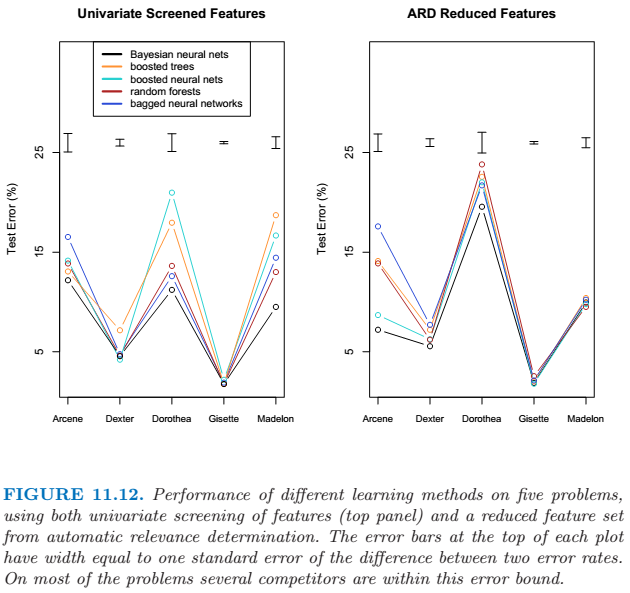
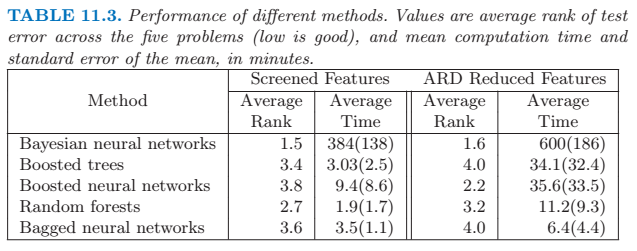

## Neural Networks
 
### Projection Pursuit Regression
 
Assume we have an input vector \\(X\\) with \\(p\\) components, and a target \\(Y\\). Let \\(\omega_m, m=1,2,...,M\\), be unit \\(p\\)-vectors of unknown parameters. The projection pursuit regression (PPR) model has the form
\\[ f(X) = \sum^M_{m=1} g_m(\omega_m^T X) \\]
The function \\(g_m\\) are unspeicifed and are estimated along with the directions \\(\omega_m\\) using some flexible smoothing method.
 
The function \\(g_m(\omega^T_m X)\\) is called a *ridge function* in \\(\mathbb{R}^p\\). The scalar variable \\(V_m = \omega^T_m X\\) is the projection of \\(X\\) onto the unit vector \\(\omega_m\\).
 
If \\(M\\) is taken arbitrarily large, for appropriate choice of \\(g_m\\) the PPR model can approximate any continuous function in \\(\mathbb{R}^p\\) arbitrarily well. Such a class of models is called a *universal approximator*.
 
Estimated \\(g_m\\) and \\(\omega_m\\) are iteratively updated with the other ones set.
 
### "Vanilla" Neural Network
 
Here we describe the most widely used "vanilla” neural net, sometimes called the single hidden layer back-propagation network, or single layer perceptron.
 
Derived features \\(Z_m\\) are created from linear combination of the inputs, and then the target \\(Y_k\\) is modeled as a function of linear combinations of the \\(Z_m\\).
\\[ \begin{align} Z_m &= \sigma(\alpha_{0m} + \alpha^T_m X), m = 1,...,M \\
T_k &= \beta_{0k} + \beta^T_k Z, k=1, ..., K \\
f_k(X) &= g_k(T), k= 1,...,K \end{align} \\]
 
The activation function \\(\sigma(v)\\) is usually chosen to be the sigmoid \\(\sigma(v) = 1 / (1+e^{-v}) \\). Sometimes Gaussian radial basis functions are used, producing what is known as a *radial basis function network*.
 
The hidden layer can be seen as a basis expansion of original inputs \\(X\\), then the network becomes  a standard linear model. However, the parameters of the basis functions are learned from the data.
 
### Fitting Neural Networks
 
The generic approach to minimizing the error function of neural networks is by gradient descent, called *back-propagation*. The gradient can be easily derived using the chain rule for differentiation. This can be computed by a forward and backward sweep over the network, keeping track only of quantities local to each unit.
 
A gradient descent update at the \\((r+1)\\)st iteration has the form
\\[\begin{align} \beta^{(r+1)}_{km} &= \beta^{(r)}_{km} - \gamma_r \sum^N_{i=1} \frac{\partial R_i} {\partial \beta^{(r)}_{km}} = \beta^{(r)}_{km} - \gamma_r \delta_{ki} z_{mi} \\
\alpha^{(r+1)}_{ml} &= \alpha^{(r)}_{ml} - \gamma_r \sum^N_{i=1} \frac{\partial R_i} {\partial \alpha^{(r)}_{ml}} = \alpha^{(r)}_{ml} - \gamma_r s_{mi} x_{il} \end{align} \\]
where \\(\gamma_r\\) is the *learning rate*, \\(\delta_{ki}\\) and \\(s_{mi}\\) are "errors" from the current model at the output and hidden layer units, respectively. And these errors satisfy
\\[ s_{mi} = \sigma'(\alpha^T_m x_i) \sum^K_{k=1} \beta_{km} \delta_{ki} \\]
known as the *back-propagation equations*.
 
The updates are a kind of *batch learning*, with the parameter updates being a sum over all the training cases. Learning can also be carried out online, processing each observation on at a time, updating the gradient after each training case, and cycling through the training cases many times. A *training epoch* refers to one sweep through the entire training set.
 
The learning rate \\(\gamma_r\\) for batch learning is usually a constant, and can be optimized by a line search that minimizes the error function at each update. With online learning \\(\gamma_r\\) should decrease to zero as the iteration \\(r \to \infty\\). This learning is a form of *stochastic approximation*, results in this field ensure convergence if \\(\gamma_r \to 0\\), \\(\sum_r \gamma_r = \infty\\) and \\(\sum_r \gamma^2_r < \infty\\). (eg, \\(\gamma_r = 1/r\\)).
 
#### Starting values
 
If the weights are near zero, then the operative part of the sigmoid is roughly linear, and hence the neural network collapses into an approximately linear model. Usually starting values for weights are chosen to be random values near zero. Hence the model starts out nearly linear, and becomes nonlinear as the weights increase.
 
#### Overfitting
 
An explicit method for regularization is *weight decay*, which is analogous to ridge regression used for linear models. We add a penalty to the error function \\(R(\theta) + \lambda J(\theta)\\), where
\\[ J(\theta) = \sum_{km} \beta^2_{km} + \sum_{ml} \alpha^2_{ml} \\
or \;\;\; J(\theta) = \sum_{km} \frac{\beta^2_{km}} {1+ \beta^2_{km}} + \sum_{ml} \frac{\alpha^2_{ml}} {1+\alpha^2_{ml}} \\]
where \\(\lambda \ge 0\\) is a tuning parameter, and the second equation is known as the *weight elimination* penalty, which has the effect of shrinking smaller weights more than the first one does.
 
#### Scaling of the Inputs
 
At the outset it is best to standardize all inputs to have mean zero and standard deviation one. This ensures all inputs are treated equally in the regularization process, and allows one to choose a meaningful range for the random starting weights.
 
With standardized inputs, it is typical to take random uniform weights over the range \\([−0.7, +0.7]\\).
 
#### Number of Hidden Units and Layers
 
Generally speaking it is better to have too many hidden units than too few. The extra weights ca be shrunk towards zero if appropriate regularization is used.
 
Typically the number of hidden units is somewhere in the range of 5 to 100, increased with larger dataset and more features.
 
Choice of the number of hidden layers is guided by background knowledge and experimentation. Each layer extracts features of the input for regression or classification. Use of multiple hidden layers allows construction of hierarchical features at different levels of resolution.
 
#### Multiple Minima
 
The error function \\(R(\theta)\\) is nonconvex, possessing many local minima. One must at least try a number of random starting configurations, and choose the solution giving lowest (penalized) error.
 
Probably a better approach is to use the average predictions over the collection. This is preferable to averaging the weights, since the nonlinearity of the model implies that this averaged solution could be quite poor.
 
Another approach is via *bagging*, which averages the predictions of networks training from randomly perturbed versions of the training data.
 
### Model Performance Comparison
 
Data comes from NIPS 2003 competition.
 
Here are the details of the learning methods that were compared:

- Bayesian neural nets. The results here are taken from Neal and Zhang (2006), using their Bayesian approach to fitting neural networks. The models had two hidden layers of 20 and 8 units. We re-ran some networks for timing purposes only.
- Boosted trees. We used the gbm package (version 1.5-7) in the R language. Tree depth and shrinkage factors varied from dataset to dataset. We consistently bagged 80% of the data at each boosting iteration (the default is 50%). Shrinkage was between 0.001 and 0.1. Tree depth was between 2 and 9.
- Boosted neural networks. Since boosting is typically most effective with  "weak" learners, we boosted a single hidden layer neural network with two or four units, fit with the nnet package (version 7.2-36) in R.
- Random forests. We used the R package randomForest (version 4.5-16) with default settings for the parameters.
- Bagged neural networks. We used the same architecture as in the Bayesian neural network above (two hidden layers of 20 and 8 units), fit using both Neal's C language package "Flexible Bayesian Modeling", and Matlab neural-net toolbox (version 5.1).
 

 

 
### Computational Consideration
 
With \\(N\\) observations, \\(p\\) predictors, \\(M\\) hidden units and \\(L\\) training epochs, a neural network fit typically requires \\(O(NpML)\\) operations.
