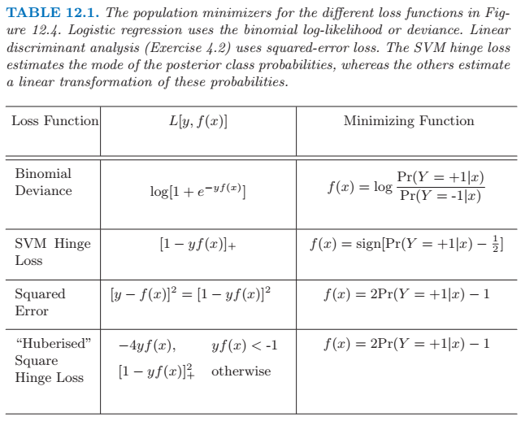
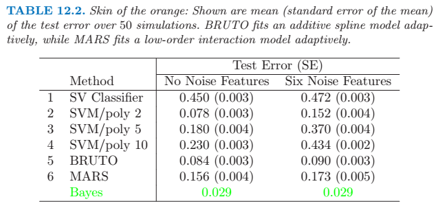
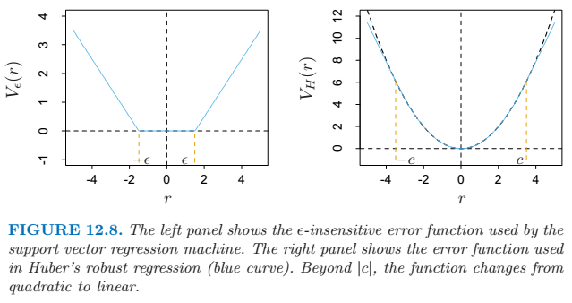

## Support Vector Machines and Flexible Discriminants
 
### The Support Vector Classifier
 
A hyperplane is denoted as \\(\{ x : \; f(x) = x^T\beta + \beta_0 = 0 \} \\), where \\(\beta\\) is a unit vector: \\( \| \beta \| = 1\\). A classification rule induced by \\(f(x)\\) is \\(G(x) = \operatorname{sign}[x^T \beta + \beta_0] \\).
 
To find the hyperplane that creates the biggest *margin* between the training points for class \\(1\\) and \\(-1\\), the optimization problem is
\\[ \underset{\beta, \beta_0}{\operatorname{min}} \| \beta \|, \;\; \mathrm{subject\, to}\; y_i(x^T_i \beta + \beta_0) \ge 1, i=1,...,N\\]
 
If classes overlap in feature space, there are 2 ways to modify the margin constraint:
1. \\(y_i(x^T_i \beta + \beta_0) \ge M - \xi_i\\),
2. \\(y_i(x^T_i \beta + \beta_0) \ge M(1 - \xi_i)\\).
\\(\forall i, \xi_i \ge 0, \sum^N_{i=1} \xi_i \le \mathrm{constant}\\).
 
The first choice seems more natural, but results in a nonconvex optimization problem.  The second measures the overlap in relative distance, which changes with the width of the margin \\(M\\), but it results in convex optimization problem. So we use the second modification.
 
And the support vector classifier for the nonseparable case has the form
\\[ \min{\|\beta \|} \; \; \mathrm{subject\; to} \; \begin{cases} y_i(x^T_i \beta + \beta_0) \ge 1 - \xi_i \; \forall i, \\ \xi_i \ge 0, \; \sum \xi_i \le \mathrm{constant} \end{cases} \\]
 
When solving the model parameters, only a part of observations will satisfy certain constraints. These observations are called the *support vectors*.  Among the support vectors, some will lie on the edge of the margin, and these are used to solve some other parameters.
 
The Lagrangian dual objective function is
\\[ L_D = \sum_{i=1}^N \alpha_i - \frac{1}{2} \sum^N_{i=1} \sum^N_{i'=1} \alpha_i \alpha_{i'} y_i y_{i'} x^T_i x_{i'} \\]
 
### Support Vector Machines and Kernels
 
We can use basis expansions \\(h_m(x)\\) such as polynomials or splines to enlarge the feature space for support vector classifier.
 
The Lagrange dual function has the form
\\[ L_D = \sum^N_{i=1} \alpha_i - \frac{1}{2} \sum^N_{i=1} \sum^N_{i'=1} \alpha_i \alpha_{i'} y_i y_{i'} \langle h(x_i), h(x_{i'})\rangle \\]
Solution has the form
\\[ f(x) = h(x)^T \beta + \beta_0 = \sum^N_{i=1} \alpha_i y_i \langle h(x), h(x_i) \rangle + \beta_0 \\]
 
Kernal function \\(K(x, x') = \langle h(x), h(x') \rangle \\), where \\(K\\) should be a symmetric positive (semi-) definite function.
 
Three popular choices for \\(K\\) in the SVM literature are

- \\(d\\)th-Degree polynomial: \\(K(x, x') = (1 + \langle x, x' \rangle )^d \\)
- Radial basis : \\(K(x, x') = \exp(- \gamma \| x - x' \|^2) \\)
- Neural network: \\( K(x, x') = \tanh(\kappa_1 \langle x, x' \rangle + \kappa_2) \\).
 
#### SVM as a Penalization Method
 
With \\(f(x) = h(x)^T \beta + \beta_0\\), consider the optimization problem
\\[ \underset{\beta_0, \beta}{\operatorname{min}} \sum^N_{i=1} [1 - y_i f(x_i)]_+ + \frac{\lambda}{2} \| \beta \|^2 \\]
where the subscript "+" indicates positive part. It has the form of *loss + penalty*.
 
The idea of the penalty function is supposed to be zero for correctly classified observations and bigger for remoter wrongly classified ones.
 

 
#### The Curse of Dimensionality
 
If the number of features \\(p\\) were large, but the class separation occurred only in the linear
subspace spanned by say \\(X_1\\) and \\(X_2\\), this kernel would not easily find the
structure and would suffer from having many dimensions to search over.
 
Prior knowledge can be built into the kernel, but a major goal of adaptive methods is to discover such structure.
 

The actural problem is to separate a 4-D spheroid out of another 4-D normal distribution.
The first class has four standard normal independent features \\(X_1, X_2, X_3, X_4\\). The second class also has four standard normal independent features, but conditioned on \\(9 \le \sum X^2_j \le 16\\). So the 2-dimension polynomial kernel performs best.
 
#### Support Vector Machines for Regression
 
First we discuss the linear regression model \\(f(x) = x^T \beta + \beta_0 \\), and then handle nonlinear generalizations. To estimate \\(\beta\\), we consider minimization of
\\[ H(\beta, \beta_0) = \sum^N_{i=1} V(y_i - f(x_i)) + \frac{\lambda}{2} \| \beta \|^2 \\]
where
\\[ V_\epsilon(r) = \begin{cases} 0 &\; if\; |r| < \epsilon, \\\ |r| - \epsilon, &\; otherwise \end{cases} \\]
or the most popular, due to Huber, has the form
\\[ V_H(r) = \begin{cases} r^2 / 2 &\; if \; |r| \le c, \\\ c|r| - c^2 / 2, &\; |r| > c \end{cases} \\]
 

 
The optimization functions are not listed here.
 
#### Discussion
 
The support vector machine can be extended to multiclass problems, essentially by solving many two-class problems.
 
### Generalizing Linear Discriminant Analysis
 
Some of the virtues of LDA

- It is a simple prototype classifier. A new observation is classified to the class with closest centroid.
- LDA is the estimated Bayes classifier if the observations are multivariate Gaussian in each class, with a common covariance matrix.
- The decision boundaries created by LDA are linear, leading to decision rules that are simple to describe and implement.
- LDA provides natural low-dimensional views of the data.
- Often LDA produces the best classification results, because of its simplicity and low variance.
 
Where LDA might fail

- Often linear decision boundaries do not adequately separate the classes. Quadratic discriminant analysis (QDA) allows for quadratic decision boundaries. More generally we would like to be able to model irregular decision boundaries.
- LDA uses a single prototype (class centroid) plus a common covariance matrix to describe the spread of the data in each class. In many situations, several prototypes are more appropriate.
- At the other end of the spectrum, we may have way too many (correlated) predictors. In cases such as this we need to restrict or regularize LDA even further.
 
Ideas to conquer these shortcomings
 
1. Basis expansion. FDA (flexible discriminant analysis) amounts to LDA in the enlarged space, which leads to more flexible forms of discriminant analysis.
2. Penalization on coefficients. In the case of too many predictors, PDA (penalized discriminant analysis) penalizes the model coefficients to e smooth or otherwise coherent in the spatial domain.
3. Mixture of more Gaussians. MDA (mixture discriminant analysis) models each class by a mixture of two or more Gaussians with different centroids, who share the same covariance matrix.
 
### Flexible Discriminant Analysis
 
A \\(K\\) classes dataset \\(\{ (X, G) \}\\), \\(\theta : \mathcal{G} \mapsto \mathbb{R}^1 \\), the problem is to solve
\\[ \underset{\beta, \theta}{\operatorname{min}} \sum^N_{i=1} (\theta(g_i) - x^T_i \beta)^2 \\]
with restrictions on \\(\theta\\) to avoid trivial solution.
 
More generally, we can find up to \\(L < K -1\\) sets of independent scorings for the class labels, \\(\theta_1, \theta_2, ..., \theta_L\\), and \\(L\\) corresponding linear maps \\(\eta_l(X) = X^T \beta_l\\), chosen to be optimal for multiple regression in \\(\mathbb{R}^p\\). The scores \\(\theta_l(g)\\) and the maps \\(\beta_l\\) are chosen to minimize the average squared residual,
\\[ ASR = \frac{1}{N} \sum^L_{l=1} \left [ \sum^N_{i=1} (\theta_l(g_i) - x_i^T \beta_l)^2 \right ]\\]
 
LDA can be performed by a sequence of linear regressions, followed by classification to the closest class centroid in the space of fits. The analogy applies both to the reduced rank version, or the full rank case when \\(L = K − 1\\).
 
By replacing the linear regression fits \\(\eta_l(x) = x^T \beta_l \\) by far more flexible, nonparametric fits, we can achieve a more flexible classifier than LDA. In this more general form the regression problems are defined via the criterion
\\[ASR(\{ \theta_l, \eta_l \}^L_{l=1}) = \frac{1}{N} \sum^L_{l=1} \left [ \sum^N_{i=1} (\theta_l(g_i) - \eta_l(x_i))^2 + \lambda J(\eta_l) \right ] \\]
where \\(J\\) is a regularizer appropriate for some forms of nonparametric regression.

FDA is performing a *penalized linear discriminant analysis* in the enlarged space.

#### Computing the FDA Estimates

We create an \\(N \times K\\) *indicator response matrix* \\(\mathbf{Y}\\) from the responses \\(g_i\\), such that \\(y_{ik} = 1\\) if \\(g_i = k\\), otherwise \\(y_{ik} = 0\\). 

1. *Multivariate nonparametric regression*. Fit a multiresponse, adaptive nonparametric regression of \\(\mathbf{Y}\\) on \\(\mathbf{X}\\), giving fitted values \\(\hat{\mathbf{Y}}\\). Let \\(\mathbf{S}_\lambda\\) be the linear operator that fits the final chosen model, and \\(\eta^*(x)\\) be the vector of fitted regression functions.

2. *Optimal scores*. Compute the eigen-decomposition of \\(\mathbf{Y}^T \hat{\mathbf{Y}} = \mathbf{Y}^T \mathbf{S}_\lambda \mathbf{Y}\\), where the eigenvectors \\(\mathbf{\Theta}\\) are normalized: \\(\mathbf{\Theta}^T \mathbf{D}_\pi \mathbf{\Theta} = \mathbf{I}\\). Here \\(\mathbf{D}_\pi = \mathbf{Y}^T \mathbf{Y} / N\\) is a diagonal matrix of the estimated class prior probabilities.

3. *Update* the model from step 1 using the optimal scores: \\(\eta(x) = \mathbf{\Theta}^T \eta^*(x)\\).

### Penalized Discriminant Analysis

Suppose the regression procedure used in FDA amounts to a linear regression onto a basis expansion \\(h(x)\\), with a quadratic penalty on the coefficients
\\[ASR(\{ \theta_l, \beta_l \}^L_{l=1}) = \frac{1}{N} \sum^L_{l=1} \left [ \sum^N_{i=1} (\theta_l(g_i) - h^T(x_i) \beta_l)^2 + \lambda \beta^T_l \mathbf{\Omega} \beta_l \right ] \\]

The steps in FDA can then be transformed into the so called *penalized discriminant analysis*, or PDA.

- Enlarge the set of predictors \\(X\\) via a basis expansion \\(h(X)\\).
- Use (penalized) LDA in the enlarged space, where the penalized Mahalanobis distance is given by 
\\[ D(x, \mu) = (h(x) - h(\mu))^T (\Sigma_W +\lambda \mathbf{\Omega})^{-1} (h(x) - h(\mu)) \\],
where \\(\Sigma_W\\) is the within-class covariance matrix of the derived variables \\(h(x_i)\\).
- Decompose the classification subspace using a penalized metric:
\\[ \max{u^T} \mathbf{\Sigma}_{Bet} u \;\mathrm{subject\; to\;} u^T(\mathbf{\Sigma}_W + \lambda \mathbf{\Omega}) u = 1 \\]

### Mixture Discriminant Analysis

LDA can be viewed as a *prototype* classifier. Each class is represented by its centroid, and we classify to the closest using a appropriate metric. 

A Gaussian mixture model for the \\(k\\)th class has density
\\[ P(X|G=k) = \sum^{R_k}_{r=1} \pi_{kr} \phi(X; \mu_{kr}, \mathbf{\Sigma}) \\]
where the *mixing proportions* \\(\pi_{kr}\\) sum to one. This has \\(R_k\\) prototypes for the \\(k\\)th class, and the same covariance matrix \\(\mathbf{\Sigma}\\) is used as the metric throughout.

MLEs are estimated with EM algorithm

E-step: Given the current parameters, compute the *responsibility* of subclass \\(c_{kr}\\) within class \\(k\\) for each of the class-\\(k\\) observations (\\(g_i = k\\))
\\[ W(c_{kr} | x_i, g_i) = \frac {\pi_{kr} \phi(x_i; \mu_{kr}, \mathbf{\Sigma})} {\sum^{R_k}_{l=1} \pi_{kl} \phi(x_i; \mu_{kl}, \mathbf{\Sigma})} \\]

M-step: Compute the weighted MLEs for the parameters of each of the component Gaussians within each of the classes, using the weights from the E-step.

 
 
