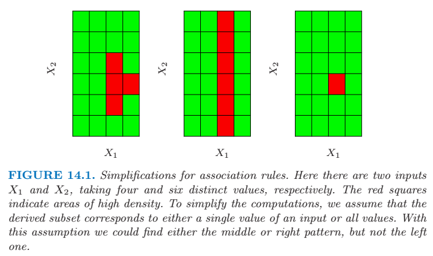
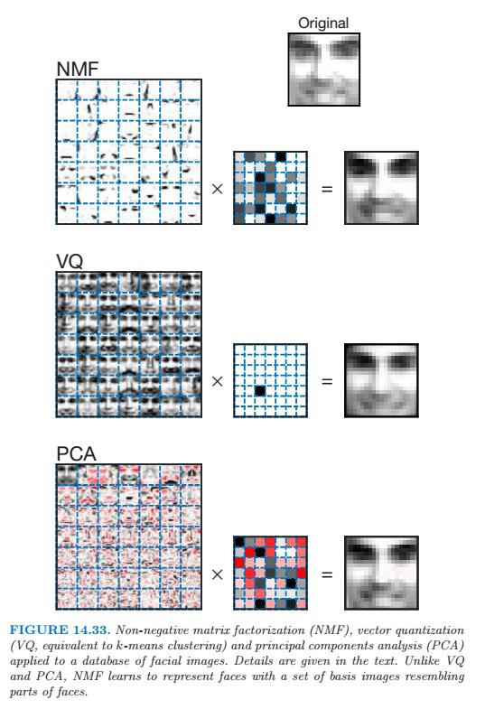

## Unsupervised Learning

### Association Rules

The goal is to find joint values of the variables \\(X=(X_1, X_2, ..., X_p)\\) that appear most frequently in the data base. Most often, \\(X_j \in \{0, 1\}\\) is binary-valued data.

More generally, the basic goal of association rule analysis is to find a collection of prototype X-values \\(v_1, ..., v_L\\) for the feature vector \\(X\\), such that the probability density \\(Pr(v_l)\\) evaluated at each of those values is relatively large. This problem is too difficult because the number of observations for which \\(X=v_l\\) will nearly always be too small for reliable estimation.

The first simplification modifies the goal. Instead of seeking *values* \\(x\\) where \\(Pr(x)\\) is large, one seeks *regions* of the X-space with high probability content relative to their size or support. Let \\(\mathcal{S}_j\\) represent the set of all possible values of the \\(j\\)th variable (its *support*), and let \\(s_j \subseteq \mathcal{S}_j\\) be a subset of these values. The modified goal can be stated as attempting to find subsets of variable values \\(s_1, ..., s_p\\) such that the probability of each of the variables simultaneously assuming a value within its resprective subset,
\\[ Pr \left [ \bigcap^p_{j=1} (X_j \in s_j) \right ] \\]
is relatively large. The intersection of subsets \\(\cap^p_{j=1}(X_j \in s_j)\\) is called a *conjunctive rule*. 

If the subset \\(s_j\\) is in fact the entire set of values \\(s_j = \mathcal{S}_j\\), as is often the case, the variable \\(X_j\\) is said *not* to appear in the rule.

#### Market Basket Analysis

Further simplification is applied. First, only two types of subsets are considered; either \\(s_j\\) consists of a *single* value of \\(X_j\\), \\(s_j = v_{0j}\\), or it consists of the entire set of values that \\(X_j\\) can assume, \\(s_j = \mathcal{S}_j\\).  And the technique of *dummy variables* is applied to turn this problem into a problem involving only binary-valued variables. 

A new set of variables \\(Z_1, Z_2, ..., Z_k\\) is created, on such variable for each of the values \\(v_{lj}\\) attainable by each of the original valriables \\(X_1, ..., X_p\\). The number of dummy variables \\(K\\) is \\( K = \sum^p_{j=1} |\mathcal{S}| \\), where \\(|\mathcal{S}_j|\\) is the number of distinct values attainable by \\(X_j\\). This transforms the original problem to finding a subset of the integers \\(\mathcal{K} \subset \{1, ..., K \}\\) such that 
\\[ Pr \left [ \prod_{k \in \mathcal{K}} Z_k = 1 \right ] = \frac{1}{N} \sum^N_{i=1} \prod_{k \in \mathcal{K}} z_{ik} \\]
is large. This is the standard formulation of the market basket problem. The set \\(\mathcal{K}\\) is called an "item set". Here \\(z_{ik}\\) is the value of \\(Z_k\\) for this \\(i\\)th case. This is called the "support" or "revalence" \\(T(\mathcal{K})\\) of the item set \\(\mathcal{K}\\). An observation \\(i\\) for which \\(\prod_{k \in \mathcal{K}} z_{ik} = 1 \\) is said to "contain" the item set \\(\mathcal{K}\\).

In association rule mining a lower support bound \\(t\\) is specified , and one seeks *all* item sets \\(\mathcal{K}_l\\) that can be formed from the variables \\(Z_1, ..., Z_K\\) with support in the data base greater than this lower bound \\(t\\) \\[ \{ \mathcal{K}_l | T(\mathcal{K}_l) > t \}\\]

#### The Apriori Algorithm

For a given support threshold \\(t\\) :

* The cardinality \\(| \{ \mathcal{K} | T(\mathcal{K}) > t \} | \\) is relatively small.
* Any item set \\(\mathcal{L}\\) consisting of a subset of the items in \\(\mathcal{K}\\) must have support greater than or equal to that of \\(\mathcal{K}\\), \\(\mathcal{L} \subseteq \mathcal{K} \Rightarrow T(\mathcal{L}) \geq T(\mathcal{K})\\).

The first pass over the data computes the support of all single-item sets. Those whose support is less than the threshold are discarded. the second pass computes the suppport of all item sets of size two that can be formed from pairs of the single items surviving the first pass. To generate all frequent itemsets with \\(|\mathcal{K} | = m\\), we need to consider only candidates such that all of their \\(m\\) ancestral item sets of size \\(m-1\\) are frequent. Passes over the data continue until all candidate rules from the previous pass have support less than the specified threshold.

Each high support item set \\(\mathcal{K}\\) returned by the Apriori algorithm is cast into a set of "association rules". The items \\(Z_k\\), \\(k \in \mathcal{K}\\), are partitioned into two disjoint subsets, \\(A \cup B = \mathcal{K} \\), and written \\(A \Rightarrow B\\). The first item subset \\(A\\) is called the "antecedent" and the second \\(B\\) the "consequent". 

The "confidence" or "predictability" \\(C(A \Rightarrow B) = T(A \Rightarrow B) / T(A)\\), which can be viewed as an estimate of \\(Pr(B | A)\\). The "expected confidence" is defined as the support of the consequent \\(T(B)\\), which is anestimate of the unconditional probability \\(Pr(B)\\). Finally, the "lift" of the rule is defined as the confidence divided by the expected confidence \\(L(A \Rightarrow B) = C(A \Rightarrow B) / T(B)\\)

The output of the entire analysis is a collection of association rules that satisfy the constraints
\\[ T(A \Rightarrow B) > t \, \, \, and \, \, \, C(A \Rightarrow B) > c \\].

### Cluster Analysis

The goal of cluster analysis is to partition the observations into groups so that the pairwise dissimilarities between those assigned to the same cluster tend to be smaller than those in different clusters.

#### Proximity Matrices

The data can be represented in terms of the proximity (alikeness or affinity) between paris of objects. These can be either *similarities* or *dissimilarities* (difference or lack of affinity). This type of data can be represented by an \\(N \times N\\) matrix \\(\mathbf{D}\\), where \\(N\\) is the number of objects, and each element \\(d_{ii'}\\) records the proximity between the \\(i\\)th and \\(i'\\)th objects. Most algorithms presume a symmetric matrix of dissimilarities with nonnegative entries and zero diagonal elements.

#### Dismimilarities Based on Attributes

Most often we have measurements \\(x_{ij}\\) for \\(i=1,2,...,N\\), on variables \\(j=1,2,...,p\\) (also called *attributes*). We define a dissimilarity \\(d_j(x_{ij}, x_{i'j})\\) between values of the \\(j\\)th atribute, and then define 
\\[ D(x_i, x_{i'}) = \sum^p_{j=1} d_j (x_{ij}, x_{i'j})\\]
as the dissimilarity between objects \\(i\\) and \\(i'\\).

##### Quantitiative variables.

Measurements of this type of variable or attribute are represented by continuous real-valued numbers. It is natural to define the "error" between them as a monotone-increasing function of their abolute difference
\\[ d(x_i, x_{i'}) = l(|x_i - x_{i'}|) \\]

##### Ordinal variables.

The values of this type of variable are often represented as contiguous integers, and the realizable values are considered to be an ordered set. Error measures for ordinal variables are generally defined by replacing their \\(M\\) original values with \\(( i - 1/2) / M\\), \\(i = 1, ..., M\\) in the prescribed order of their original values. They are then treated as quantitative variables on this scale.

##### Categorical variables

With unordered categorical (also called nominal) variables, the degree-of-difference between pairs of values must be delineated explicitly. The matrix can be arranged in a symmetrix matrix with elements \\(L_{rr'} = L_{r'r}\\), \\(L_{rr} = 0\\), \\(L_{rr'} \geq 0\\). The most common choice is \\(L_{rr'} = 1\\) for all \\(r \neq r'\\).

#### Object Dissimilarity

The procedure for combining the \\(p\\)-individual attribute dissimilarities \\(d_j(x_{ij}, x_{i'j})\\), \\(j=1,2,...,p\\) into a single overall measure of dissimilarity \\(D(x_i, x_{i'})\\) between two objects is nearly always done by means of a weighted average (convex combination)
\\[D(x_i, x_{i'}) = \sum^p_{j=1} \omega_j \cdot d_j (x_{ij}, x_{i'j}); \, \, \sum^p_{j=1} \omega_j = 1\\]
where \\(\omega_j\\) is a weight. It is important to realize that setting the weight to the same value for each variable does *not* necessarily give all attributes equal influence. And this can be achieved by setting \\(\omega_j \sim 1/\bar{d_j}\\). \\(\bar{d_j}\\) is the average dissimilarity on the \\(j\\)th attribute.
\\[ \bar{d_j} = \frac{1}{N^2} \sum^N_{i=1} \sum^N_{i'=1} d_j (x_{ij}, x_{i'j})\\]

If the squared-error distance is used for each coordinate, then \\(\bar{d_j} = 2 \cdot \mathrm{var}_j\\). Thus, the relative importance of each such variable is proportional to its variance over the data set.

In general, setting \\(\omega_j = 1/ \bar{d_j}\\) for all attributes, irrespective of type, will cause each one of them to equally influence the overall dissimilarity between paris of objects \\((x_i, x_{i'})\\). Although this may seem reasonable, and is often recommended, it can be highly **counterproductive**.

Observations often have *missing values* in one or more of the attributes. The most common method is to omit each observation pair \\(x_{ij}, x_{i'j}\\) having at least one value missing, when computing the dissimilarity between \\(x_i\\) and \\(x_{i'}\\). This method can fail in the circumstance when both observations have no measured values in common. In this case, both observations could be deleted from the analysis. Alternatively, the missing values could be imputed using the mean or median of each attribute over the nonmissing data. For categorical variables, one could consider the value "missing" as just another categorical value.

#### Clustering Algorithms

Clustering algorithms fall into three  distinct types: combinatorial algorithms, mixture modeling, and mode seeking.

*Combinatorial algorithm* work directly on the observed data with no direct reference to an underlying probability model. 

*Mixture modeling* supposes that the data is an *i.i.d* sample from some population described by a probability density function. This model is then fit to the data by maximum likelihood or corresponding Bayesian approaches. 

*Mode seekers* ("bump hunters") take a nonparametric perspective, attempting to directly estimate distinct modes of the probability density function.

#### Combinatorial Algorithms

Each observation is uniquely labeled by an integer \\(i \in \{1, ..., N\}\\). A prespecified number of clusters \\(K < N\\) is postulated, and each one is labeled by an integer \\(k \in \{1, ..., K\}\\). Each observation is assigned to one and only one cluster. These assignments can be characterized by a many-to-one mapping, or *encoder* \\(k = C(i)\\), that assigns the \\(i\\)th observation to the \\(k\\)th cluster. One seeks the particular encode that achieves the required goal, based on the dissimilarities between every pair of observations.

The "parameters" of the procedure are the individual cluster assignments for each of the N observations. These are adjusted so as to *minimize* a "loss" function that characterizes the degree to which the clustering goal is *not* met.

A natural loss (or "energy") function would be 
\\[ W(C) = \frac{1}{2} \sum^K_{k=1} \sum_{C(i)=k} \sum_{C(i')=k} d(x_i, x_{i'}) \\]
It is sometimes referred to as the *within-cluster* point scatter.

\\[ T = \frac{1}{2} \sum^N_{i=1} \sum^N_{i'=1} d_{i i'} = W(C) + B(C) \\]
where \\(d_{i i'} = d(x_i, x_{i'}) \\). Here \\(T\\) is the *total* point scatter, which is a constant given the data, independent of cluster assignment.

\\[ B(C) = \frac{1}{2} \sum^K_{k=1} \sum_{C(i)=k} \sum_{C(i') \neq k} d_{i i'} \\]
This is the *between-cluster* point scatter.

The number of distinct assignments of complete enumeration is :
\\[ S(N,K) = \frac{1}{K!} \sum^K_{k=1} (-1)^{K - k} { K \choose k } k^N \\]

The goal is to identify a small subset that is likely to contain the optimal one, or at least a good suboptimal partition. Such feasible strategies are based on iterative greedy descent. An initial partition is specified. At each iterative step, the cluster assignments are changed in such a way the value of the criterion is improved from its previous value. When the prescription is unable to provide an improvement, the algorithm terminates with the current assignments as its solution. However, these algorithms converge to *local* optima which may be highly suboptimal when compared to the global optimum.

#### K-means

All variables are of the quantitative type, and squared Euclidean distance
\\[ d(x_i, x_{i'}) = \sum^p_{j=1} (x_{ij} - x_{i'j})^2 = \parallel x_i - x_{i'} \parallel ^2 \\]
is chosen as the dissimilarity measure.

The within-point scatter can be written as 
\\[ W(C) = \sum^K_{k=1} N_k \sum_{C(i) = k} \parallel x_i - \bar{x_k} \parallel ^2 \\]
where \\(\bar{x_k} = (\bar{x_{1k}}, ..., \bar{x_{pk}}) \\) is the mean vector associated with the \\(k\\)th cluster, and \\(N_k = \sum^N_{i=1} I(C(i) = k)\\).

We can obtain \\(C^{*}\\) by solving the enlarged optimization problem
\\[ \underset{C, \{ m_k \}^K_1}{\operatorname{min}} \sum^K_{k=1} N_k \sum_{C(i)=k} \parallel x_i - m_k \parallel ^2 \\]

The K-means Clustering

1. For a given cluster assignment \\(C\\), the total cluster variance is minimized with resprect to \\(\{ m_1, ..., m_K\} \\) yielding the means of the currently assigned clusters.
2. Given a current set of means \\(\{ m_1, ..., m_K\} \\), formula above is minimized by assigning each observation to the closest (current) cluster mean,. That is,
   \\[ C(i) = \underset{1 \leq k \leq K} {\operatorname{argmin}} \parallel x_i - m_k \parallel ^2 \\]
3. Steps 1 and 2 are iterated until the assignments do not change.

The convergence is assured. However, the result may represent a suboptimal local minimum.

#### Gaussian Mixtures as Soft K-means Clustering

The K-means clustering procedure is closely related to the EM algorithm for estimating a certain Gaussian mixture model. The E-step assigns "responsibilities" for each data point based in its relative density under each mixture component, while the M-step recomputes the component density parameters based on the current responsibilities.

Suppose we specify \\(K\\) mixture components, each with a Gaussian density having scalar covariance matrix \\(\sigma^2 \mathbf{I} \\). Then the relative density under each mixture component is a monotone function of the Euclidean distance between the data point and the mixture center. Hence in this setup EM is a "soft" version of K-means clustering, making probabilistic assignments of points to cluster centers. 

As the variance \\(\sigma^2 \to 0\\), these probabilities become 0 and 1, and the two methods coincide.

#### K-medoids

In the most common form, centers for each cluster are restricted to be one of the observations assigned to the cluster. 

K-medoids Clustering
1. For a given cluster assignment \\(C\\) find the observation in the cluster minimizing total distance to other points in that cluster:
 \\[ i^*_k = \underset{ \{ i:C(i)=k \}} {\operatorname{argmin}} \sum_{C(i')=k} D(x_i, x_{i'}) \\]
 Then \\(m_k = x_{i^{*}_k}\\), \\(k=1,2,...,K\\) are the current estimates of the cluster centers.
2. Given a current set of cluster centers \\(\{ m_1, ..., m_K\}\\), minimize the total error by assigning each observation to the closest (current) cluster center:
 \\[ C(i) = \underset{1 \leq k \leq K}{\operatorname{argmin}} D(x_i, m_k) \\]
3. Iterate steps 1 and 2 until the assignments do not change.

This algorithm assumes attribute data, but the approach can also be applied to data described *only* by proximity matrices. There is no need to explicitly compute cluster centers; rather we just keep track of the indices.

K-medoids is far more computationally intensive than K-means.

Alternating between above formulas represents a particular heuristic search strategy for trying to solve
\\[ \underset{C, \{ i_k \}^K_1}{\operatorname{min}} \sum^K_{k=1} \sum_{C(i)=k} d_{i i_k} \\]

#### Practical Issues

In order to apply K-means one must select an initialization. Usually specifying the centers is more convenient. Suggestions range from simple random selection to a deliberate strategy based on forward stepwise assignment. At each step a new center \\(i_k\\) is chosen to minimize the criterion earlier defined for algorithms, given the centers chosen at the previous steps. This continues for \\(K\\) steps, thereby producing \\(K\\) initial centers with which to begin the optimization algorithm.

The *Gap statistic* comopares the curve \\(\log W_K\\) to the curve obtained from data uniformly distributed over a rectangle containing the data. It estimates the optimal number of clusters to be the place where  the gap between the two curves is largest.

#### Hierarchical Clustering

Hierarchical clustering methods do not require the choice for the number of clusters and a starting configuration assignment. Instead, they require the user to specify a measure of dissimilarity between (disjoint) *groups* of observations, based on the pairwise dissimilarities among the observations in the two groups.

Strategyies for hierarchical clustering divide into two basic paradigms: *agglomerative* (bottom-up) and *divisive* (top-down). Agglomerative strtegies start at the bottom and at eacdh level recursively merge a selected pair of clusters into a single cluster. The pair chosen for merging consist of the two groups with the smallest intergroup dissimilarity. Divisive methods start at the top and at each level recursively split one of the existing clusters at that level into two new clusters. The split is chosen to produce two new groups with the largest between-group dissimilarity. With both paradigms there are \\(N-1\\) levels in the hierarchy.

Recursive binary splitting/agglomeration can be represented by a rooted binary tree. The nodes of the trees represent groups. The root node represents the entire data set.

All agglomerative and some divisive methods possess a monotonicity property. That is, the dissimilarity between merged clusters is monotone increasing with the level of the merger. Thus the binary tree can be plotted so that the height of each node is proportional to the value of the intergroup dissimilarity between its two daughters. The terminal nodes representing individual observations are all plotted at zero height. This type of graphical display is called a *dendrogram*.

The extent to which the hierarchical structure produced by a dendrogram actually represents the data itself can be judged by the *cophenetic correlation coefficient*. This is the correlation betwen the \\(N(N-1)/2\\) pairwise observation dissimilarities \\(d_{ii'}\\) input to the algorithm and their corresponding *cophenetic* dissimilarities \\(C_{i i'}\\) derived from the dendrogram. The cophenetic dissimilarity \\(C_{i i'}\\) between two observations \\((i, i')\\) is the intergroup dissimilarity at which observations \\(i\\) and \\(i'\\) are first joined together in the same cluster.

The cophenetic dissimilarity is a very restrictive dissimilarity measure. First, the \\(C_{i i'}\\) over the observations must contain many ties, since only \\(N-1\\) of the total \\(N(N-1)/2\\) values can be distinct. Also these dissimilarities obey the *ultrametric inequality* : \\(C_{i i'} \leq \max{\{C_{ik}, C_{i' k} \}}\\) for any three observations \\((i, i', k)\\).

##### Agglomerative Clustering

Let \\(G\\) and \\(H\\) represent two groups. The dissimilarity \\(d(G,H)\\) between \\(G\\) and \\(H\\) is computed from the set of pairwise observation dissimilarities \\(d_{i i'}\\) where one member of the pair \\(i\\) is in \\(G\\) and the other \\(i'\\) is in \\(H\\). 

*Single linkage* (SL) takes the intergroup dissimilarity to be that of the closest (least dissimilar) pair. This is also called the *nearest-neighbor* technique. \\[d_{SL} (G, H) = \underset{i \in G, i' \in H} {\operatorname{min}} d_{i i'}\\]

*Complete linkage* (CL) agglomerative clustering (*furthest-neighbor* technique) takes the intergroup dissimilarity to be that of the furthest (most dissimlar) pair. \\[d_{CL} (G, H) = \underset{i \in G, i' \in H} {\operatorname{max}} d_{i i'}\\] 

*Group average* (GA) clustering uses the average dissimilarity between the groups. \\[d_{GA} (G, H) = \frac{1}{N_G N_H} \sum_{i \in G} \sum_{i' \in H} d_{i i'}\\]
where \\(N_G\\) and \\(N_H\\) are the respective number of observations in each group.

If we define the *diameter* \\(D_G\\) of a group of observations as the largest dissimilarity among its members \\[D_G = \underset{i \in G, i' \in G} {\operatorname{max}} d_{i i'},\\] then single linkage can produce clusters with very large diameters. Complete linkage represents the opposite extreme.

##### Divisive Clustering

In the clustering setting, a potential advantage of divisive over agglomerative methods can occur when interest is focused on partitioning the data into a relatively *small* number of clusters.

A method can avoid depending on the starting configuration at each step was proposed. It begins by placing all observations in a single cluster \\(G\\). It then chooses that observation whose average dissimilarity from all the other observations is largest. This observation forms the first member of a second cluster \\(H\\). At each successive step that observation in \\(G\\) whose average distance from those in \\(H\\), minus that for the remaining observations in \\(G\\) is largest, is transferred to \\(H\\). This continues until the corresponding difference in averages becomes negative. That is, there are no longer any observations in \\(G\\) that are, on average, closer to those in \\(H\\). The result is a split of the original cluster into two daughter clusters. These two clusters represnt the second level of the hierarchy.

### Self-Organizing Maps

This mehod can be viewed as a constrained version of K-means clustering, in which the prototype are encouraged to lie in a one- or two-dimensional manifold in the feature space. The resulting manifold is also referred to as a *constrained topological map*. The technique also bears a close relationship to *principal curves and surfaces*.

We consider a SOM with a two-dimensinal rectangular grid of \\(K\\) prototypes \\(m_j \in \mathbb{R}^p \\). Each of the \\(K\\) prototypes are parametrized with respect to an integer coordinate pair \\(\ell_j \in \mathcal{Q}_1 \times \mathcal{Q}_2\\). The \\(m_j\\) are initialized to lie in the two-dimensional principal component plane of the data. We can think of the prototypes as "buttons", "sewn" on the principal component plane in a regular pattern. The SOM procedure tries to bend the plane so that the buttons approximate the data points as well as possible. Once the model is fit, the observations can be mapped down onto the two-dimensional grid.

The observations \\(x_i\\) are processed one at a time. We find the closest prototype \\(m_j\\) to \\(x_i\\) in Euclidean distance in \\(\mathbb{R}^p\\), and then for all neighbors \\(m_k\\) of \\(m_j\\), move \\(m_k\\) toward \\(x_i\\) via the update 
\\[ m_k \leftarrow m_k + \alpha(x_i - m_k) \\]

The "neighbors" of \\(m_j\\) are defined to be all \\(m_k\\) such that the distance between \\(\ell_j\\) and \\(\ell_k\\) is small. Notice that distance is defined in the space \\(\mathcal{Q}_1 \times \mathcal{Q}_2\\) of integer topological coordinates of the prototypes, rather than in the feature space \\(\mathbb{R}^p\\). 

The performance of the SOM algorithm depends on the learning rate \\(\alpha\\) and the distance threshold \\(r\\). Typically \\(\alpha\\) is decresed from say 1.0 to 0.0 over a few thousand iterations. Similarly \\(r\\) is decreased linearly from starting value \\(R\\) to 1 over a few thousand iterations.

More sophisticated versions modify the update step according to distance:
\\[ m_k \leftarrow m_k + \alpha h (\| \ell_j - \ell_k \|) (x_i - m_k) ,\\]
where the *neighborhood function* \\(h\\) gives more weight to prototypes \\(m_k\\) with indices \\(\ell_k\\) closer to \\(\ell_j\\) than to those further away.

If we take the distance \\(r\\) small enough so that each neighborhood contains only one point, the SOM algorithm is an online version of K-means clustering.

In the batch version of the SOM, we update each \\(m_j\\) via :
\\[ m_j = \frac{\sum \omega_k x_k} {\sum \omega_k}\\]
The sum is over points \\(x_k\\) that mapped neighbors \\(m_k\\) of \\(m_j\\).

### Principal Components, Curves and Surfaces

Principal components are a sequence of projections of the data, mutually uncorrelated and ordered in variance.

#### Principal Components

The principal components of a set of data in \\(\mathbb{R}^p\\) provide a sequence of best linear approximations to that data, of all ranks \\(q \leq p\\).

Denote the observations by \\(x_1, x_2, ..., x_N\\), and consider the rank-\\(q\\) linear model for representing them \\[ f(\lambda) = \mu + \mathbf{V}_q \lambda, \\]
where \\(\mu\\) is a location vector in \\(\mathbb{R}^p\\), \\(\mathbf{V}_q\\) is a \\(p \times q\\) matrix with \\(q\\) orthogonal unit vectors as columns, and \\(\lambda\\) is a \\(q\\) vector of parameters. This is the parametric representation of an affine hyperplane of rank \\(q\\). 

By minimizing the *reconstruction error* with least squares method, we can have 
\\[\begin{align} \hat{\mu} &= \bar{x} \\
\hat{\lambda}_i &= \mathbf{V}^T_q (x_i - \bar{x}) \end{align} \\]

We construct the *singular value decomposition* of \\(\mathbf{X}\\) :
\\[ \mathbf{X} = \mathbf{UDV}^T \\]
This is a standard decomposition in numerical analysis, and many algorithms exist for its computation. Here \\(\mathbf{U}\\) is an \\(N \times p\\) orthogonal matrix (\\(\mathbf{U}^T \mathbf{U} = \mathbf{I}_p\\)) whose columns \\(\mathbf{u}_j\\) are called the *left singular vectors; \\(\mathbf{V}\\) is a \\(p \times p\\) orthogonal matrix (\\(\mathbf{V}^T \mathbf{V} = \mathbf{I}_p\\)) with columns \\(v_j\\) called the *right singular vectors*, and \\(\mathbf{D}\\) is a \\(p \times p\\) diagonal matrix, with diagonal elements \\(d_1 \geq d_2 \geq \cdots \geq d_p \geq 0\\) known as the *singular values*. For each rank \\(q\\), the solution \\(\mathbf{V}_q\\) consists of the first \\(q\\) columns of \\(\mathbf{V}\\). The columns of \\(\mathbf{UD}\\) are called the principal components of \\(\mathbf{X}\\). The \\(N\\) optimal \\(\hat{\lambda}_i\\) are given by the first \\(q\\) principal components (the \\(N\\) rows of the \\(N \times q\\) matrix \\(\mathbf{U}_q \mathbf{D}_q\\)).

Principal components have many other nice properties. the linear combination \\(\mathbf{X} v_1\\) has the highest variance among all linear combinations of the features; \\(\mathbf{X} v_2\\) has the highest variance among all linear combinations satisfying \\(v_2\\) orthogonal to \\(v_1\\), and so on.

#### Principal Curves and Surfaces

Principal curves generalize the principal component line, providing a smooth one-dimensional curved approximation to a set of data points in \\(\mathbb{R}^p\\). A principal surface is more general, providing a curved manifold approximation of dimension 2 or more.

Let \\(f(\lambda)\\) be a parameterized smooth curve in \\(\mathbb{R}^p\\). Hence \\(f(\lambda)\\) is a vector function with \\(p\\) coordinates, each a smooth function of the signle parameter \\(\lambda\\). For each data value \\(x\\), let \\(\lambda_f(x)\\) define the closest point on the curve to \\(x\\). Then \\(f(\lambda)\\) is called a principal curve for the distribution of the random vector \\(x\\) if 
\\[ f(\lambda) = E(X| \lambda_f(X) = \lambda) \\]
This says \\(f(\lambda)\\) is the average of all data points that project to it, that is, the points for which it is "responsible". This is also known as a *self-consistency* property.

Consider a set of \\(k\\) prototypes and for each point \\(x\\) in the support of a distribution, identify the closest prototype, which is responsible for it. The set of \\(k\\) points that minimize the expected distance from \\(X\\) to its prototype are called the principal points of the distribution. Each principal point is self-consistent, in that it equals the mean of \\(X\\) in its Voronoi region. Principal points are the distributional analogs of centroids found by K-means clustering. Principal curves can be viewed as \\(k=\infty\\) principal points, but constrained to lie on a smooth curve.

Principal surfaces have exactly the same from as principal curves, but are of higher dimension. 

Principal surfaces are very similar to self-organizing maps. The SOM and principal surface will agree only as the number of SOM prototypes grows very large.

#### Spectral Clustering

The problem can be started with a \\(N \times N\\) matrix of pairwise similarities \\(s_{i i'} \geq 0\\) between all observation pairs. the observations are represented in an undirected *similarity graph* \\( G = \langle V, E \rangle\\). The \\(N\\) vertices \\(v_i\\) represent the observations, and pairs of vertices are connected by an edge if their similarity is positive (or exceeds some threshold). The edges are weighted by the \\(s_{i i'}\\). We wish to partition the graph, such that edges between different groups have low weight, and within a group have high weight.

The *mutual K-nearest-neighbor graph* is one of the most popular ways to define a similarity matrix. Define \\(\mathcal{N}_K\\) to be the symmetric set of nearby pairs of points; specifically a pair \\((i, i')\\) is in \\(\mathcal{N}_K\\) if point \\(i\\) is among the K-nearest neighbors of \\(i'\\), or vice-versa. Then we connect all symmetric nearest neighbors, and give them edge weight \\(w_{i i'} = s_{i i'}\\); otherwise the edge weight is zero.

The matrix of edge weights \\(\mathbf{W} = \{ w_{ii'} \}\\) from a similarity graph is called the *adjacency matrix*. The *degree* of vertex \\(i\\) is \\(g_i = \sum_{i'} w_{ii'}\\), the sum of the weights of the edges connected to it. Let \\(G\\) be a diagonal matrix with diagonal elements \\(g_i\\).

Finally, the *graph Laplacian* is defined by 
\\[\mathbf{L} = \mathbf{G} - \mathbf{W} \\]

This is called the *unnormalized graph Laplacian*; a number of normalized versions have been proposed - these standardize the Laplacian with respect to the node degrees \\(g_i\\), for example, \\(\mathbf{L} = \mathbf{I} - \mathbf{G}^{-1} \mathbf{W}\\).

Spectral clustering finds the \\(m\\) eigenvectors \\(\mathbf{Z}_{N \times m}\\) corresponding to the \\(m\\) *smallest* eigenvalues of \\(\mathbf{L}\\) (ignoring the trivial constant eigenvector). Using a standard method like K-means, we then cluster the rows of \\(\mathbf{Z}\\) to yield a clustering of the original data points.

#### Kernel Principal Components

Kernel PCA expand the scope of PCA, mimicking what we would obtain if we were to expand the features by non-linear transformantions, and then apply PCA in this transformed feature space.

#### Sparse Principal Components

For a single component, their *sparse principal component* technique solves
\\[ \underset{\theta, v}{\operatorname{min}} \sum^N_{i=1} \| x_i - \theta v^T x_i \|^2_2 + \lambda \|v \|^2_2 + \lambda_1 \|v\|_1\\]
subject to \\(\|\theta \|_2 = 1\\).

### Non-negative Matrix Factorization

Non-negative matrix factorization is a recent alternative approach to principal components analysis. It is useful for modeling non-negative data such as images.

The \\(N \times p\\) data matrix \\(\mathbf{X}\\) is approximated by \\[\mathbf{X} \approx \mathbf{WH}\\] where \\(\mathbf{W}\\) is \\(N \times r\\) and \\(\mathbf{H}\\) is \\(r \times p\\), \\(r \leq \max(N, p)\\). We assume that \\(x_{ij}, w_{ik}, h_{kj} \geq 0\\).

The matrices \\(\mathbf{W}\\) and \\(\mathbf{H}\\) are found by maximizing 
\\[ L(\mathbf{W}, \mathbf{H}) = \sum^N_{i=1} \sum^p_{j=1} [ x_{ij} \log(\mathbf{WH})_{ij} - (\mathbf{WH})_{ij}] \\]
This is the log-likelihood from a model in which \\(x_{ij}\\) has a Poisson distribution with mean \\((\mathbf{WH})_{ij}\\), which is reasonable for positive data.

### Independent Component Analysis and Exploratory Projection Pursuit

Multivariate data are often viewed as multiple indirect measurements arising from an underlying source, which typically cannot be directly measured. Factor anslysis is a classical technique that aims to identify these latent sources.

#### Latent Variables and Factor Analysis

The singular-value decomposition \\(\mathbf{X} = \mathbf{UDV}^T\\) has a latent variable representation. Writing \\(\mathbf{S} = \sqrt{N} \mathbf{U}\\) and \\(\mathbf{A}^T = \mathbf{DV}^T / \sqrt{N}\\), we have \\(\mathbf{X}=\mathbf{SA}^T\\), and hence each of the columns of \\(\mathbf{X}\\) is a linear combination of the columns of \\(\mathbf{S}\\), which have zero mean, are uncorrelated and have unit variance. This can simply be \\(X = \mathbf{A}S\\). And if given any orthogonal \\(p \times p\\) matrix \\(\mathbf{R}\\), we can have 
\\[\begin{align} X &= \mathbf{A}S \\ &= \mathbf{AR}^T \mathbf{R} S \\ &= \mathbf{A}^* S^* \end{align} \\]
and \\(\operatorname{Cov}(S^*) = \mathbf{R} \operatorname{Cov}(S) \mathbf{R}^T = \mathbf{I} \\).

The classical *facotr analysis* model has the form \\(X = \mathbf{A} S + \epsilon\\). Here \\(S\\) is a vecotr of \\(q < p\\) underlying latent variables or factors, \\(\mathbf{A}\\) is a \\(p \times q\\) matrix of factor *loadings*, and the \\(\epsilon_j\\) are uncorrelated zero-mean disturbances. Typically the \\(S_j\\) and \\(\epsilon_j\\) are modeled as Gaussian random variables, and the model is fit by maximum likelihood.

#### Independent Component Analysis

The independent component analysis (ICA) model has exactly the same form as \\(X = \mathbf{A} S\\), except the \\(S_\ell\\) are assumed to be *statistically independent* rather than uncorrelated. 

lack of correlation determines the second-degree cross-moments (covariances) of a multivariate distribution, while in general statistical independence determines all of the cross-moments. Since the multivariate Gaussian distribution is determined by its second moments alone, it is the exception, and any Gaussian independent components can be determined only up to a rotation, as before. Hence identifiability problems can be avoided if we assume that the \\(S_\ell\\) are independent and *non-Gaussian*.

### Multidimensional Scaling

Multidimensional Scaling (MDS) requires only the dissimilarities \\(d_{ij}\\), in constract to the SOM and principla curves and surfaces which need the data points \\(x_i\\). 

Multidimensional scaling seeks values \\(z_1, z_2, ..., z_N \in \mathbb{R}^k\\) to minimize the *stress function* :
\\[ S_M(z_1, z_2, ..., z_N) = \sum_{i \neq i'} (d_{ii'} - \| z_i - z_{i'} \|)^2\\]
This is known as *least squares* or *Kruskal-Shephard* scaling. The idea is to find a lower-dimensional representation of the data that preserves the pairwise distances as well as possible. 

A variation on least squares scaling is the *Sammon mapping* which minimizes 
\\[ S_{Sm}(z_1, z_2, ..., z_N) = \sum_{i \neq i'} \frac{(d_{ii'} - \| z_i - z_{i'} \|)^2}{d_{ii'}} \\]
Here more emphasis is put on preserving smaller pairwise distances.

In *classical scaling*, we instead start with similarities \\(s_{ii'}\\) : ofen we use the centered inner product \\(s_{ii'} = \langle x_i - \bar{x}, x_{i'} - \bar{x} \rangle\\). The problem then is to minimize 
\\[ S_C(z_1, z_2, ..., z_N) = \sum_{i, i'} (s_{ii'} - \langle z_i - \bar{z}, z_{i'} - \bar{z} \rangle )^2 \\]

Least squares and classical scaling are referred to as *metric* scaling methods, in the sense that the actual dissimilarities or similarities are approximated. *Shephard-Kruskal nonmetric scaling* effectively uses only ranks. Nonmetric scaling seeks to minimize the stress function
\\[ S_{NM}(z_1, z_2, ..., z_N) = \frac{\sum_{i \neq i'} [\| z_i - z_{i'} \| - \theta(d_{ii'})]^2} {\sum_{i \neq i'} \| z_i - z_{i'} \|^2} \\]
over the \\(z_i\\) and an arbitrary increasing function \\(\theta\\). 

SOM, principal surfaces and MDS all represent high-dimensional data in a low-dimensional coordinate system. Points close together in the original feature space should map close together on the manifold of principal surface and SOM, but points far apart in feature space might also map close together. This is less likely in multidimensional scaling since it explicitly tries to preserve all pairwise distances.

### Nonlinear Dimension Reduction and Local Multidimensional Scaling

Suitable for problems where signal-to-noise ratio is very high! (eg, physical systems).

##### Isometric feature mapping (ISOMAP) 
ISOMAP constructs a graph to aproximate the geodesic distance between points along the manifold. Specifically, for each dta point we find its neighbor points within some small Euclidean distance. A graph is constructed with an edge between any two neighboring points. The geodesic distance between any two points is then approximated by the shortest path between points on the graph. Finally, calssical scaling is applied to the graph distances, to produce a low-dimensional mapping.

##### Local linear embedding
It tries to preserve the local affine structure of the high-dimensional data. Each data point is approximated by a linear combination of neighboring points. 

1. For each data point \\(x_i\\) in \\(p\\) dimensions, we find its \\(K\\)-nearest neighbors \\(\mathcal{N}(i)\\) in Euclidean distance.
2. We approximate each point by an affine mixture of the points in its neighborhood. 
\\[ \underset{W_{ik}}{\operatorname{min}} \| x_i - \sum_{k \in \mathcal{N}(i)} w_{ik} x_k \|^2 \\]
\\(w_{ik}\\) is the contribution of point \\(k\\) to the reconstruction of point \\(i\\).
3. Finally, we find points \\(y_i\\) in a space of dimension \\(d < p\\) to minimize with \\(w_{ik}\\) fixed.
\\[ \sum_{i=1}^N \| y_i - \sum_{k=1}^N w_{ik}y_k \|^2 \\]

##### Local MDS
This method takes the simplest and arguably the most direct approach. Define \\(\mathcal{N}\\) to be the symmetric set of nearby pairs of points. Then construct the stress function
\\[ S_L (z_1, z_2, ..., z_N) = \sum_{(i, i') \in \mathcal{N}} (d_{ii'} - \| z_i - z_{i'} \|)^2 + \sum_{(i, i') \notin \mathcal{N}} \omega \cdot (D - \| z_i - z_{i'} \|)^2 \\]
Here \\(D\\) is some large constant and \\(omega\\) is a weight. The idea is that points that are not neighbors are considered to be very far apart. Such pairs are given a small wweight \\(\omega\\) so that they don't dominate the overall stress function.

### The Google PageRank Algorithm
Let \\(L_{ij}=1\\) if page \\(j\\) points to page \\(i\\), and zero otherwise. Let \\(c_j = \sum_{i=1}^N L_{ij}\\) equal the number of pages pointed to by page \\(j\\) (number of out links). Then the Google PageRanks \\(p_i\\) are defined by the recursive relationship
\\[ p_i = (1-d) + d\sum_{j=1}^N (\frac{L_{ij}}{c_j}) p_j \\]
where \\(d\\) is a positive constant.

The matrix notation
\\[ \mathbf{p} = (1 -d) \mathbf{e} + d \cdot \mathbf{LD}_c^{-1} \mathbf{p} = \mathbf{Ap} \\]

The matrix \\(\mathbf{A}\\) has a real eigenvalue equal to one, and one is its largest eigenvalue. We can find \\(\hat{\mathbf{p}}\\) by starting with some \\(\mathbf{p} = \mathbf{p}_0\\) we iterate
\\[ \mathbf{p}_k \gets \mathbf{Ap}_{k-1}; \;\;\;\;\; \mathbf{p}_k \gets N \frac{\mathbf{p}_k}{\mathbf{e}^T \mathbf{p}_k} \\]
The fixed points \\(\hat{\mathbf{p}}\\) are the desired PageRanks.
