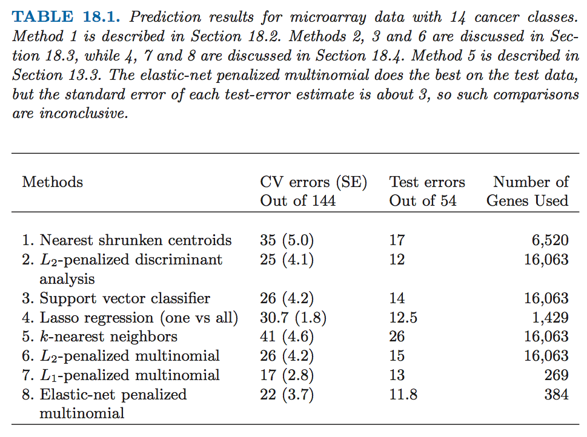
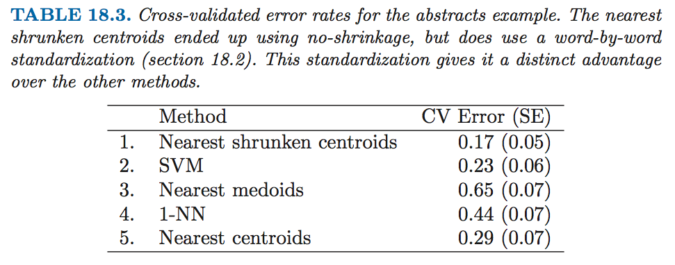

## High-Dimensional Problems: *p >> N*

### When *p* is Much Bigger than *N*

High variance and overfitting are a major concern in this setting. As a result, simple, highly regularized approaches often become the methods of choice.

### Diagonal Linear Discriminant Analysis and Nearest Shurnken Centroids

The *diagonal-covariance* LDA rule for classification:

The *discriminant score* for class \\( k \\) is 
\\[ \delta_k (x^*) = - \sum_{j=1}^p \frac{(x_j^* - \bar{x}_{kj})^2}{s_j^2} + 2 \log \pi_k \\]
Here \\(x^* = (x_1^*, x_2^*, ..., x_p^*)^T\\) is a vector of expression values for a test observation, \\(s_j\\) is the pooled within-class standard deviation of the \\(j\\)th gene (feature), and \\(\bar{x}_{kj} = \sum_{i \in C_k} x_{ij} / N_k\\) is the mean of the \\(N_k\\) values for gene \\(j\\) in class \\(k\\), with \\(C_k\\) being the index set for class \\(k\\). We call \\(\tilde{x}_k=(\tilde{x}_{k1}, \tilde{x}_{k2}, ..., \tilde{x}_{kp})^T\\) the *centroid* of class \\(k\\).

The first part of equation above is simply the standardized squared distance of \\(x^*\\) to the \\(k\\)th centroid. The second part is a correction based on the class *prior probability* \\(\pi_k\\), where \\( \sum_{k=1}^K \pi_k = 1 \\). The classification rule is then :
\\[ C(x^*) = \ell \; \; \mathrm{if} \;\; \delta_\ell (x^*) = \max_k \delta_k (x^*) \\]

The diagonal LDA classifier is equaivalent to a nearest centroid classifier after appropriate standardization. It is also a special case of the naive-Bayes classifier. It assumes that the features in each class have independent Gaussian distributions with the same variance.

One drawback is that it uses all of the features, and hence is not convenient for interpretation.

*Nearest shrunken centroids* (NSC) shrinks the classwise mean toward the overall mean for each feature separately, so that features that are not contributing to the class predictions are automatically dropped.

### Linear Classifiers with Quadratic Regularization

#### Regularized Discriminant Analysis

Linear discriminant analysis involves the inversion of a \\(p \times p\\) within-covariance matrix. When \\(p \gg N\\), this matrix can be huge, has rank at most \\(N < p \\), and hence is singular. RDA overcomes the singularity issues by regularizing the within-covariance estimate \\(\hat{\Sigma}\\). 
\\[ \hat{\Sigma}(\gamma) = \gamma \hat{\Sigma} + (1 - \gamma) \mathrm{diag}(\hat{\Sigma}), \;\;\mathrm{with}\;\; \gamma \in [0,1] \\]
Note that \\(\gamma = 0\\) corresponds to diagonal LDA, which is the "no shrinkage" version of nearest shrunken centroids.

#### Logistic Regression with Quadratic Regularization

Logistic regression can be modified in a similar way.
\\[ \mathrm{Pr}(G=k | X=x) = \frac{\exp(\beta_{k0} + x^T \beta_k)}{\sum_{\ell=1}^K \exp(\beta_{\ell 0} + x^T \beta_\ell)} \\]
This has *K* coefficient vectors of log-odds parameters \\(\beta_1, \beta_2, ..., \beta_K\\). We regularize the fitting by maximizing the penalized log-likelihood
\\[ \underset{\{\beta_{0k}, \beta_k\}_1^K}{\max} \left[ \sum_{i=1}^N \log{\mathrm{Pr}(g_i|x_i)} - \frac{\lambda}{2} \sum_{k=1}^K \| \beta_k \|_2^2 \right] \\]

#### Computational Shortcuts When *p >> N*

When \\(p > N\\), the computations can be cariied out in an *N*-dimensional space, rather than *p*, via the singular value decomposition method.

Given the \\(N \times p\\) data matrix \\(\mathbf{X}\\), let
\\[\mathbf{X} = \mathbf{UDV}^T = \mathbf{RV}^T\\]
be the SVD of \\(\mathbf{X}\\); that is, \\(\mathbf{V}\\) is \\(p \times N\\) with orthonormal columns, \\(\mathbf{U}\\) is \\(N \times N\\) orthogonal, and \\(\mathbf{D}\\) a diagonal matrix with elements \\(d_1 \le d_2 \le d_N \le 0\\). The matrix \\(\mathbf{R}\\) is \\(N \times N\\), with rows \\(r_i^T\\).

### Linear Classification with \\(L_1\\) Regularization

Lasso can provide a (severe) form of feature selection. By convex duality one can show that when \\(p > N\\) the number of non-zero coefficients is at most \\(N\\) for all values of \\(\lambda\\).

### Classification When Features are Unavailable

We need to have the \\(N \times N\\) *proximity* matrix, if we don't have the feature vectors.

#### Classification Using Inner-Product Kernels and Pairwise Distances

+ SVM and other "kernelized" methods can be used.
+ Nearest neighbor classification can be used obviously. 
+ Logistic and multinomial regression with quadratic regularization can be implemented with inner-product kernels. 
+ Principal components can be used as well. 
+ Closest medoids classification and \\(k\\)-medoids clustering can be applied.

It is useful to consider what we **cannot** do with inner-product kernels and distances:

+ We cannot standardize the variables.
+ We cannot assess directly the contributions of individual variables. No nearest shrunken centroids model. No lasso penalty.
+ We cannot separate the good variables from the noise.

