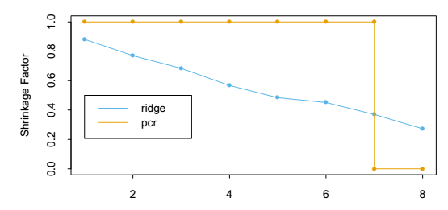

Elem Note C3

2014-06-15 12:22:24

# Note for < The Elements of Statistics Learning>
 
## Linear Methods for Regression
 
### The *Gram-Schmidt procedure* or *Regression by Successive Orthogonalization*
 
1. Initiallize \\(z_0 = x_0 = 1\\).
2. For \\(j=1,2,...,p\\)
 
    Regress \\(x_j\\) on \\)z_0, z_1, ..., z_{j-1}\\) to produce coefficients \\( \widehat{\gamma}_{lj} = \left \langle z_l, x_j \right \rangle/\left \langle z_l, z_l \right \rangle, l=0,...,j-1 \\) and residual vector \\( z_j = x_j - \sum^{j-1}_{k=0}{{\widehat{\gamma}}_{kj}z_k} \\).
 
3. Regress \\)y\\) on the residual \\)z_p\\) to give the estimate \\)\widehat{\beta}_p\\).
 
    The result of this algorithm is \\[\widehat{\beta}_p=\frac{\left \langle z_p, y\right \rangle} { \left \langle z_p, z_p\right \rangle} \\]
 
### Ridge Regression
 
The point is to penalize those big coefficients which are caused by highly correlated variables.
\\[\hat{\beta}^{ridge}=\underset{\beta}{\operatorname{arg\,min}}\left \{ \sum^N_{i=1}{(y_i - \beta_0 - \sum^p_{j=1}{x_{ij}\beta_j})^2} + \lambda\sum^p_{j=1}\beta^2_j \right \}\\]
 
\\[\hat{\beta}^{ridge}=\underset{\beta}{\operatorname{arg\,min}}\sum^N_{i=1}{\left (y_i-\beta_0-\sum^p_{j=1}{x_{ij}\beta_j}\right )}^2, \\\ subject\ to\ \sum^p_{j=1}\beta_j^2 \leq t\\]
 
Ridge regression is connected to PCA. Ridge would shrink the coefficients of the components with the least variance, while PCA would just drop those.

 
### Lasso Regression
 
Very similar to ridge.
 
\\[\hat{\beta}^{lasso}=\underset{\beta}{\operatorname{arg\,min}} \left \{ \frac{1}{2} \sum^N_{i=1}{(y_i - \beta_0 - \sum^p_{j=1}{x_{ij}\beta_j})^2} + \lambda\sum^p_{j=1} \left |\beta_j \right | \right\}\\]
 
\\[\hat{\beta}^{lasso}=\underset{\beta}{\operatorname{arg\,min}}\sum^N_{i=1}{\left (y_i-\beta_0-\sum^p_{j=1}{x_{ij}\beta_j}\right )}^2, \\\ subject\ to\ \sum^p_{j=1}\left |\beta_j\right | \leq t\\]
 
Computation is a quadratic programming problem.
 
### Least Angle Regression
 
1. Standardize the predictors to have mean zero and unit norm. Start with the residual \\(\mathbf{r=y-\bar{y}}\\), \\(\beta_1, \beta_2,...,\beta_p=0\\).
2. Find the predictor \\(\mathbf{x}_j\\) most correated with \\(\mathbf{r}\\).
3. Move \\(\beta_j\\) from 0 towards its least-squares coefficient \\(\left \langle \mathbf{x}_j, \mathbf{r} \right \rangle\\), until some other competitor \\(\mathbf{x}_k\\) has as much corelation with the current residual as does \\(\mathbf{x}_j\\).
4. Move \\(\beta_j\\) and \\(\beta_k\\) in the direction defined by their joint least squares coefficient of the current residual on \\((\mathbf{x}_j, \mathbf{x}_k)\\), until some other competitor \\(\mathbf{x}_l\\) has as much correlation with the current residual.
5. Continue  in this way until all \\(p\\) predictors have been entered. After \\(\operatorname{min}(N-1, p)\\) steps, we arrive at the full least-squares solution.
 
Suppose \\(\mathcal{A}_k\\) is the active set of variables at the begginning of the \\(k\\)th step, and let \\(\beta_{\mathcal{A}_k}\\) be the coefficient vector for these variables at this step; there will be \\(k-1\\) nonzero values, and the one just entered will be zero. If \\(\mathbf{r}_k=\mathbf{y} - \mathbf{X}_{\mathcal{A}_k}\beta_{\mathcal{A}_k}\\) is the current residual, then the direction for this step is \\[\delta_k=(\mathbf{X}^T_{\mathcal{A}_k}\mathbf{X}_{\mathcal{A}_k})^{-1}\mathbf{X}^T_{\mathcal{A}_k}\mathbf{r}_k\\]. And the coefficient profile then evolves as \\(\beta_{\mathcal{A}_k}(\alpha)=\beta_{\mathcal{A}_k} + \alpha\cdot\delta_k\\).
 
#### Lasso Modification
 
4a. If a non-zero coefficient hits zero, drop its variable from the active set of variables and recompute the current joint least squares direction.
 
This algorithm is an efficient way of computing the solution to any lasso problem especially when \\(p \gg N\\).
 
### Principal Component Regression
 
Do univariate regression with the orthogonal eigenvalue components, while dropping the ones with least variance.
 
### Partial Least Squares
 
It uses the response \\(\mathbf{y}\\) to construct its directions, its solution path is a nonlinear function of \\(\mathbf{y}\\). It seeks directions that have high variance and have high correlation with the response, while principal components regression keys only on high variance.
 
### Comparison of the Selection and Shrinkage methods
 
* Ridge regression shrinks all directions, but shrinks low-variance directions more.
* Principal components regression leaves M high-variance directions alone, and discards the rest.
* Partial least squares also tends to shrink the low-variance directions, but can actually inflate some of the higher variance directions. This can make PLS a little unstable, and cause it to have slightly higher prediction error compared to ridge regression.
* A full study is given in Frank and Friedman (1993). These authors conclude that for minimizing prediction error, idge regression is generally preferable to variable subset selection, principal omponents regression and partial least squares. However the improvement over the latter two methods was only slight.
 
### Computational Consideration
 
Least squares fitting is usually done via the Cholesky decomposition of the matrix \\(\mathbf{X}^T\mathbf{X}\\) or a \\(\mathrm{QR}\\) decomposition of \\(\mathbf{X}\\). With \\(N\\) observations and \\(p\\) features, the Cholesky decomposition requires \\(p^3+Np^2/2\\) operations, while the \\(\mathrm{QR}\\) decomposition requires \\(Np^2\\) operations. Depending on the relative
size of \\(N\\) and \\(p\\), the Cholesky can sometimes be faster; on the other hand, it can be less numerically stable (Lawson and Hansen, 1974). Computation
of the lasso via the LAR algorithm has the same order of computation as a least squares fit.
