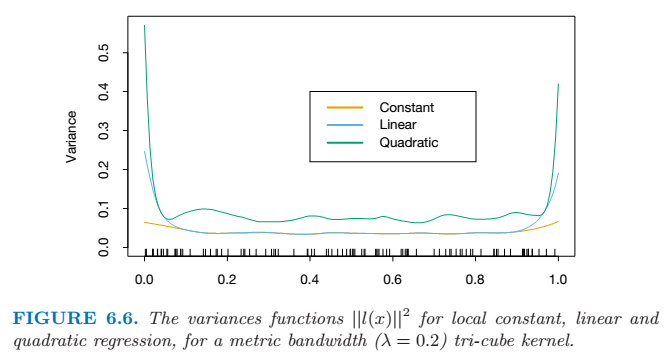

## Kernel Smoothing Methods
 
Kernel function is a *weighting* function that is used to *smooth* the estimated function in the function domain \\(\mathbb{R}^p\\). A kernel \\(K_\lambda(x_0, x_i)\\) assigns a weight to \\(x_i\\) based on its distance from \\(x_0\\).
 
### One-Dimensional Kernel Smoothers
 
#### *K* Nearest Neighbor
 
\\[\hat{f}(x_0) = \frac{\sum^n_{i=1} K_\lambda(x_0, x_i) y_i}{\sum^n_{i=1} K_\lambda(x_0, x_i)} \\]
 
The *Epanechnikov* quadratic kernel :
\\[K_\lambda(x_0,x) = D\left ( \frac{|x-x_0|}{h_\lambda(x_0)}\right ) ,\\]
\\[D(t)=\begin{cases} {}^3/_4 (1-t^2) \; & if \, |t| \le 1; \\\ 0 \; & otherwise \end{cases}.\\]
where \\(h_\lambda(x_0)\\) is a width function that determine the sizes of the nearest neighbors. We can have \\(h_k(x_0)=|x_0 - x_{[k]}|\\) where \\(x_{[k]}\\) is the \\(k\\)th closest \\(x_i\\) to \\(x_0\\).
 
* Large \\(\lambda\\) implies lower variance but higher bias.
* Metric window widths (constant \\(h_\lambda(x)\\)) tend to keep the bias of the estimate constant, but the variance is inversely proportional to the local density. Nearest-neighbor window widths, on the opposite, keep the constant variance and the absolute bias varies inversely with local density.
* Denote the weight of each observation as \\(w_i\\). It is now natural to insist on neighborhoods with a total weight content \\(k\\) (relative to \\(\sum w_i\\)). Fractional parts can be used in case of overflow.
* Another popular compact kernel \\[D(t)=\begin{cases} (1-|t|^3)^3 \; & if \, |t| \le 1; \\\ 0 \; & otherwise \end{cases}.\\]
 
#### Local Linear Regression
 
Locally weighted regression solves a separate weighted least squares problem at each  target point \\(x_0\\),
\\[ \underset{\alpha(x_0),\beta(x_0)}{\operatorname{min}} \sum^N_{i=1} K_\lambda (x_0, x_i) [y_i - \alpha(x_0) - \beta(x_0)x_i]^2 \\]
 
Befine the vector-valued function \\(b(x)^T=(1,x)\\). Let \\(\mathbf{B}\\) be the \\(N \times 2\\) regression matrix with \\(i\\)th row \\(b(x_i)^T\\), and \\(\mathbf{W}(x_0)\\) the \\(N \times N\\) diagonal matrix with \\(i\\)th diagonal element \\(K_\lambda(x_0, x_i)\\). Then
\\[\hat{f}(x_0) = b(x_0)^T(\mathbf{B}^T\mathbf{W}(x_0)\mathbf{B})^{-1}\mathbf{B}^T\mathbf{W}(x_0)\mathbf{y} = \sum^N_{i=1} l_i(x_0)y_i \\]
\\( l_i(x_0)\\) is sometimes referred to as the *equivalent kernel*.
 
#### Local Polynomial Regression

 
Local linear fits tend to be biased in regions of curvature of the true function, a phenomenon referred to as *trimming the hills* and *filling the valleys*. Local quadratic regression is generally able to correct this bias. Bigger variance is the tradeoff for this correction.
 

 
### Selecting the Width of the Kernel
 
There is a natural bias-variance tradeoff as we change the width of the averaging window.
* If the window is narrow, the variance will be relatively large, while the bias will tend to be small.
* If the window is wide, the variance will be small relative to any \\(y_i\\), while the bias will be higher.
 
### Structured Local Regression
 
#### Structured Kernels
\\[ K_{\lambda, A}(x_0, x) = D \left ( \frac{(x-x_0)^T \mathbf{A} (x-x_0)}{\lambda} \right ) \\]
when \\(\mathbf{A}\\) is identity, it is degenerated to spherical kernel as
\\[ K_{\lambda, A}(x_0, x) = D \left ( \frac {\| x- x_0 \|} {\lambda} \right ) \\]
 
#### Structured Regression Functions
 
The analysis-of-variance (ANOVA) decompositions of a regression function \\( E(Y|X) = f(X_1, X_2,..., X_p) \\) has the form
\\[ f(X_1, X_2, ..., X_p) = \alpha + \sum_j g_j(X_j) + \sum_{k < l} g_{kl}(X_k, X_l) + \dots \\]
 
An important special case is the class of *varying coefficient models*. Suppose, for example, that we divide the \\(p\\) predictors in \\(X\\) into a set \\((X_1, X_2, ..., X_q)\\) with \\(q < p\\), and the remainder of the variables we collect in the vector \\(Z\\). We then assume the conditionally linear model
\\[ f(X) = \alpha(Z) + \beta_1(Z)X_1 + \dots + \beta_q(Z) X_q\\]
For given \\(Z\\), this is a linear model, but each of the coefficients can vary with \\(Z\\). It is natural to fit such a model by locally weighted least squares:
\\[\underset{\alpha(z_0),\beta(z_0)}{\operatorname{min}} \sum^N_{i=1} K_\lambda(z_0, z_i) (y_i - \alpha(z_0) - x_{1i}\beta_1(z_0) - \dots - x_{qi}\beta_q(z_0))^2\\]
 
### Local Likelihood and Other Models
 
Associated with each observation \\(y_i\\) is a parameter \\(\theta_i=\theta(x_i)=x^T_i \beta\\). We can model \\(\theta(x)\\) more flexibly by using the likelihood local to \\(x_0\\) for inference of \\(\theta(x_0) = x^T_0 \beta(x_0)\\) :
\\[l(\beta(x_0)) = \sum^N_{i=1} K_\lambda(x_0, x_i) l(y_i, x^T_i \beta(x_0)).\\]
 
And by maximizing the local likelihood as
\\[ l(\theta(z_0)) = \sum^N_{i=1} K_\lambda(z_0, z_i) l(y_i, \eta(x_i, \theta(z_0))),\\]
it will fit a varying coefficient model \\(\theta(z)\\).
 
### Kenel Density Estimation and Classification
 
#### Kernel Density Estimation
 
The smooth Parzen estimate :
\\[\hat{f_X}(x_0) = \frac{1}{N\lambda} \sum^N_{i=1} K_\lambda(x_0, x_i)\\]
 
If applying the Gaussian kernel \\(K_\lambda(x_0, x) = \phi(|x-x_0|/\lambda)\\), and letting \\(\phi_\lambda\\) denote the Gaussian density with mean zero and standard-deviation \\(\lambda\\), then equation above has the form \\[ \begin{align} \hat{f_X}(x) &= \frac{1}{N} \sum^N_{i=1} \phi_\lambda (x-x_i) \\\ &= \frac{1}{N(2 \lambda^2 \pi)^{p/2}} \sum^N_{i=1} e^{- \frac{1}{2} (\| x_i - x_0 \| / \lambda)^2} \end{align}\\]
 
#### Kernel Density Classification
 
In learning the separate densities from data, one might decide to settle for a rougher, high-variance fit to capture these features, which are irrelevant for the purposes of estimating the posterior probabilities. In fact, if classification is the ultimate goal, then we need only to estimate the posterior well near the decision boundary.
 
#### The Naive Bayes Classifier
 
The naive Bayes model is especially appropriate when the dimension \\(p\\) of the feature space is high, making density estimation unattractive.
 
It assumes that given a class \\(G=j\\), the features \\(X_k\\) are independent, \\[f_j(X) = \prod^p_{k=1} f_{jk}(X_k)\\]
 
And the logit-transform has the form of a *generalized additive model*.
\\[\begin{align} \log \frac{Pr(G=l|X)}{Pr(G=J|X)} &= \log \frac{\pi_l}{\pi_J} + \sum^p_{k=1} \log \frac{f_{lk}(X_k)} {f_{Jk}(X_k)} \\\ &= \alpha_l + \sum^p_{k=1}g_{lk}(X_k) \end{align}\\]
 
### Radial Basis Functions and Kernels
 
Radial basis functions treat the kernel functions \\(K_\lambda(\xi, x)\\) as basis functions. And this leads to the model \\[\begin{align} f(x) &= \sum^M_{j=1} K_{\lambda_j}(\xi_j, x) \beta_j \\\ &= \sum^M_{j=1} D  \left ( \frac{\| x - \xi_j \|}{\lambda_j} \right ) \beta_j \end{align} \\] where each basis element is indexed by a location or *prototype* parameter \\(\xi_j\\) and a scale parameter \\(\lambda_j\\). A popular choice for \\(D\\) is the standard Gaussian density function.
 
Optimize the sum-of-squares with respect to all the parameters is commonly referred to as an \\(\mathrm{RBF}\\) network.
\\[\underset{\{ \lambda_j, \xi_j, \beta_j \}^M_1} {\operatorname{min}} \sum^N_{i=1} \left ( y_i - \beta_0 - \sum^M_{j=1} \beta_j \operatorname{exp} \left \{ - \frac{(x_i - \xi_j)^T (x_i - \xi_j)}{\lambda^2_j} \right \} \right ) ^2 \\]
 
*Renormalized* radial basis functions can void the *holes* effect, which means regions of \\(\mathbb{R}^p\\) where non of the kernels has appreciable support.
\\[ h_j(x) = \frac{D(\| x- \xi_j \| / \lambda)}{\sum^M_{k=1} D(\| x- \xi_j \| / \lambda)} \\]
 
### Computational Consideration
 
Kernel and local regression and density estimation are *memory-based* methods: the model is the entire traning data set, and the fitting is done at evaluation or prediction time. NOT feasible for real-time applications.
 
 
