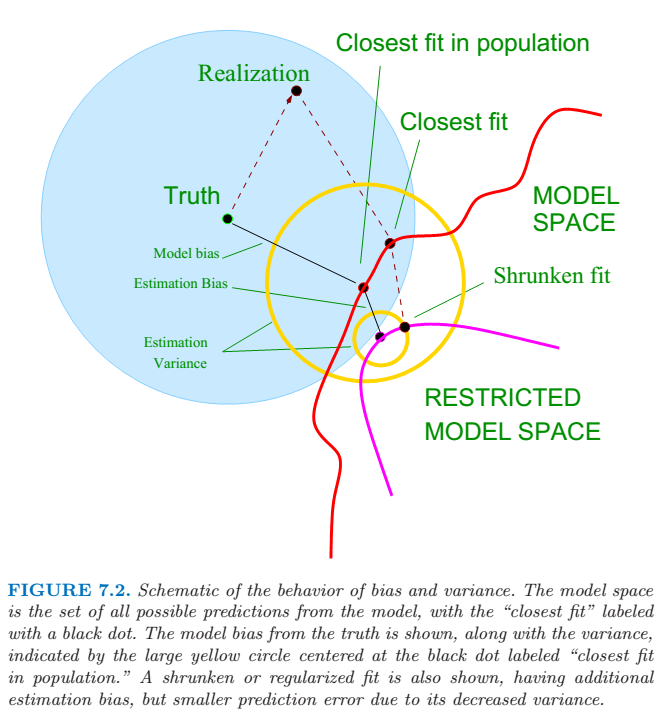

## Model Assessment and Selection
 
*deviance* = \\(-2 \times \\) log-likelihood
\\[ L(Y,\theta(X)) = -2 \dot \log{Pr_{\theta(X)}(Y)}\\]
The "\\(-2\\)" in the definition makes the log-likelihood loss for the Gaussian distribution match squared-error loss.
 
### The Bias-Variance Decomposition
 
\\[\mathrm{Err}(x_0) = \mathrm{Irreducible Error} + \mathrm{Bias}^2 + \mathrm{Variance}\\]
 
Bias can be further divided to *model bias* and *estimation bias*.

* For linear models fit by ordinary least squares, the estimation bias is zero.
* For restricted fits, such as ridge regression, it is positive. And we trade it for reduced variance.
 

 
### Optimism of the Training Error Rate
 
The expected error is :
\\[\mathrm{Err} = \mathrm{E}_\mathcal{T} \mathrm{E}_{X^0, \, Y^0} [L(Y^0, \hat{f}(X^0)) | \mathcal{T}]\\]
where the point \\((X^0, Y^0)\\) is a new test data point, and \\(\mathcal{T}\\) is the training set.
 
The training error is :
\\[ \overline{\mathrm{err}} = \frac{1}{N} \sum^N_{i=1} L(y_i, \hat{f}(x_i)) \\]
 
The in-sample error is :
\\[\mathrm{Err_{in}} = \frac{1}{N} \sum^N_{i=1}  \mathrm{E}_{Y^0} [L(Y^0, \hat{f}(x_i)) | \mathcal{T}] \\]
The \\(Y^0\\) notation indicates that we observe \\(N\\) new response values at each of the training points \\(x_i\\).
 
And the *optimism* is defined as :
\\[\mathrm{op} \equiv \mathrm{Err_{in}} - \overline{\mathrm{err}}\\]
 
Finally the average optimism is the expectation of the optimism over training sets
\\[ \omega \equiv \mathrm{E}_{\mathbf{y}}(\mathrm{op}) \\\ = \frac{2}{N} \sum^N_{i=1} \operatorname{Cov}(\hat{y_i}, y_i)\\]
 
In summary, we have the important relation
\\[ \mathrm{E}_{\mathbf{y}}(\mathrm{{Err}_{in}} ) =  \mathrm{E}_{\mathbf{y}}( \overline{\mathrm{err}}  ) +  \frac{2}{N} \sum^N_{i=1} \operatorname{Cov}(\hat{y_i}, y_i) \\]
\\[ \sum^N_{i=1} \operatorname{Cov}(\hat{y_i}, y_i) = d \sigma^2_\varepsilon \\]
 
### Estimates of In-Sample Prediction Error
 
\\(C_p\\) statistic, when \\(d\\) parameters are fit under squared error loss.
\\[ C_p =  \overline{\mathrm{err}} + 2 \cdot \frac{d}{N} \hat{\sigma_\varepsilon}^2 \\]
 
More generally, the *Akaike information criterion* :
\\[\mathrm{AIC} = - \frac{2}{N} \cdot \mathrm{loglik} + 2 \cdot \frac{d}{N}\\]
 
For the Gaussian model, the \\(\mathrm{AIC}\\) statistic is equivalent to \\(C_p\\).
 
### The Effective Number of Parameters
 
\\[\mathrm{df}(\hat{\mathbf{y}}) =  \frac{\sum^N_{i=1} \operatorname{Cov}(\hat{y_i}, y_i)}{\sigma^2_\varepsilon} = \operatorname{trace}(\mathbf{S})\\]
 
### The Bayesian Approach and BIC
 
The Bayesian information criterion (BIC), like AIC, is applicable in settings where the fitting is carried out by maximization of a log-likelihood.
\\[ \mathrm{BIC} = -2 \cdot \mathrm{loglik} + (\log{N}) \cdot d \\]
It is also known as the Schwarz criterion.
 
BIC tends to choose the simpler model compared to AIC. If the sample size \\(N \to \infty\\), BIC will select the correct model while AIC tends to choose models too complex. However, for finite samples, BIC often chooses models that are too simple, because of its heavy penalty on complexity.
 
### Vapnik-Chervonenkis Dimension
 
The VC dimension of the class \\(\{f(x,\alpha)\}\\) is defined to be the largest number of points (in some configuration) that canbe shattered by members of \\(\{f(x,\alpha)\}\\).
 
It measures the complexity of a class of functions by assessing how wiggly its members can be.
 
In general, a linear indicator function in \\(p\\) dimensions has VC dimension \\(p+1\\), which is also the number of free parameters. And the family \\(\sin(\alpha x)\\) has infinite VC dimension.
 
VC dimension can be used in constructing an estimate of (extra-sample) prediction error.
 
### Cross-Validation
 
Cross-validation typically estimates well only the expected prediction error.
 
#### K-Fold Cross-Validation
 
Let \\(\kappa : \{1,...,N\} \mapsto \{1,...,K\} \\) be an indexing function that indicates the partition to wich observation \\(i\\) is allocated by the randomization. Denote by \\(\hat{f}^{-k}(x, \alpha)\\) the fitted function, computed with the \\(k\\)th part of the data removed, with a tuning parameter \\(\alpha\\). The corss-validation estimate of prediction error is \\[\mathrm{CV}(\hat{f}, \alpha) = \frac{1}{N} \sum^N_(i=1) L(y_i, \hat{f}^{-\kappa(i)}(x_i, \alpha)) \\] Our final chosen model is \\(f(x, \hat{\alpha})\\) that minimizes \\(\mathrm{CV}(\hat{f}, \alpha)\\).
 
#### The Right Way to Use Cross-Validation
 
In general, with a multistep modeling procedure, corss-validation must be applied to the entire sequence of modeling steps. In particular, samples must be "left out" before any selection or filtering steps are applied.
 
### Bootstrap Methods
 
As with cross-validation, the bootstrap seeks to estimate the conditional error \\(\mathrm{Err}_\mathcal{T}\\), but typically estimates well only the expected prediction error \\(\mathrm{Err}\\).
 
The basic idea is to randomly draw datasets with replacement from the training data, each sample the same size as the original trainning set. This is done \\(B\\) times, producing \\(B\\) bootstrap datasets. Then we fit the model to each of the bootstrap datasets, and examine the behavior of the fits over the \\(B\\) replications.
 
It is similar to Monte-Carlo estimation.
 
 
 
