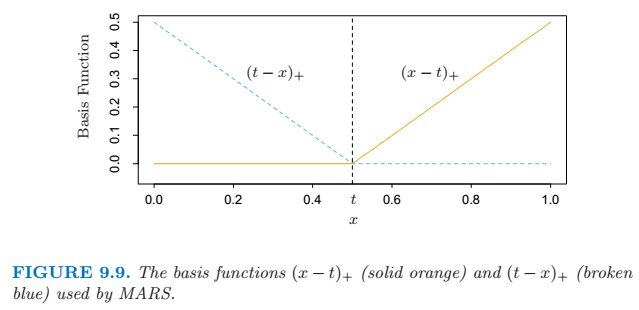

## Additive Models, Trees, and Related Methods
 
### Generalized Additive Models
 
In the regression setting, a generalized additive model has the form
\\[ \mathrm{E}(Y | X_1, X_2, ..., X_p) = \alpha + f_1(X_1) + f_2(X_2) + \cdots + f_p(X_p) \\]
 
The *additive* logistic regression model replaces each linear term by a more general functional form
\\[ \log{\left ( \frac{\mu(X)} {1-\mu(X)} \right )} = \alpha + f_1(X_1) + f_2(X_2) + \cdots + f_p(X_p) \\]
 
Each \\(f_j\\) is an unspecified smooth ("nonparametric") function.
 
In general, the conditional mean \\(\mu(X)\\) of a repsonse \\(Y\\) is related to an additive function of the predictors via a *link* function \\(g\\) :
\\[g[\mu(X)] = \alpha + f_1(X_1) + f_2(X_2) + \cdots + f_p(X_p) \\]
 
- \\(g(\mu) = \mu\\) is the identity link, used for linear and additive models for Gaussian response data.
- \\(g(\mu) = \operatorname{logit}(\mu)\\) as above, or \\(g(\mu) = \operatorname{probit}(\mu)\\), the probit link function, for modeling binomial probabilities. The probit function is the inverse
Gaussian cumulative distribution function: \\(\operatorname{probit}(\mu) = \Phi^{-1}(\mu)\\).
- \\(g(\mu) = \log(\mu)\\) for log-linear or log-additive models for Poisson count data.
 
All three of these, together with the gamma and negative-binomial distributions generate the well-known class of generalized linear models.
 
#### Fitting Additive Models
 
The additive model has the form
\\[ Y = \alpha + \sum^p_{j=1} f_j(X_j) + \epsilon \\]
where the error term \\(\epsilon\\) has mean zero.
 
The penalized sum of squares
\\[ \mathrm{PRSS}(\alpha, f_1, f_2, ..., f_p) = \sum^N_{i=1} \left ( y_i - \alpha - \sum^p_{j=1} f_j(x_{ij}) \right )^2 + \sum^p_{j=1} \lambda_j \int f''_j (t_j)^2 dt_j \\]
where the \\(\lambda_j \ge 0\\) are tuning parameters.
 
The Backfitting Algorithm for Additive Models
 
1\. Initialize: \\(\hat{\alpha} = \frac{1}{N} \sum^N_1 y_i, \; \hat{f_j} \equiv 0, \forall i, j. \\)
 
2\. Cycle: \\(j=1,2,...,p,...,1,2,..., p, ...,\\)
\\[ \begin{align} \hat{f_j} &\gets \mathcal{S}_j \left [ \{ y_i - \hat{\alpha} - \sum_{k \neq j} \hat{f_k}(x_{ik}) \} ^N_1 \right ], \\\ \hat{f_j} &\gets \hat{f_j} - \frac {1}{N} \sum^N_{i=1} \hat{f_j} (x_{ij}). \end{align} \\]
until the functions \\(\hat{f_j}\\) change less than a prespecified threshold. \\(\mathcal{S}_j\\) is a cubic smoothing spline.
 
#### Additive Logistic Regression
 
Local Scoring Algorithm for the Additive Logistic Regression Model
 
1\. Compute starting values: \\(\hat{\alpha} = \log{[\bar{y} / (1-\bar{y})]}\\), where \\(\bar{y} = \operatorname{ave}(y_i)\\), the sample proportion of ones, and set \\(\hat{f_j} \equiv 0 \forall j\\).
 
2\. Define \\(\hat{\eta_i} = \hat{\alpha} + \sum_j \hat{f_j}(x_{ij})\\) and \\(\hat{p_i} = 1 / [1+\exp(-\hat{\eta_i}] \\). Iterate:
 
a) Construct the working target variable \\(z_i = \hat{\eta_i} + \frac{y_i - \hat{p_i}} {\hat{p_i} (1 - \hat{p_i})} \\)
 
b) Construct weights \\(w_i = \hat{p_i} ( 1- \hat{p_i} ) \\)
 
c) Fit an additive model to the targets \\(z_i\\) with weights \\(w_i\\), using a weighted backfitting algorithm. This give new estimates \\(\hat{\alpha}, \hat{f_j}, \forall j \\).
 
3\. Continue step 2. until the change in the function falls below a pre-specified threshold.
 
### Tree-Based Methods
 
A key advantage of the recursive binary tree is its interpretability.
 
#### Regression Trees
 
Suppose the dataset consists of \\(p\\) inputs and a response, for each of \\(N\\) observations. We first have a partition into \\(M\\) regions \\(R_1, R_2, ..., R_M\\), and we model the response as a constant \\(c_m\\) in each region :
\\[ f(x) = \sum^M_{m=1} c_m I(x \in R_m) \\]
 
To minimize the sum of square error, it is easy to get \\( \hat{c_m} = \operatorname{ave}(y_i | x_i \in R_m) \\).
 
Starting with all of the data, consider a spliting variable \\(j\\) and split point \\(s\\), and define the pair of half-planes \\( R_1(j, s) = \{ X|X_j \le s \} \\) and \\( R_2(j, s) = \{ X|X_j > s \} \\).
 
Then we seek the splitting varialbe \\(j\\) and split point \\(s\\) that solve
\\[ \underset{j, \; s}{\operatorname{min}} \left [ \underset{c_1}{\operatorname{min}} \sum_{x_i \in R_1(j,s)} (y_i - c_1)^2 + \underset{c_2}{\operatorname{min}} \sum_{x_i \in R_2(j,s)} (y_i - c_2)^2  \right ] \\]
 
The preferred strategy is to grow a large tree \\(T_0\\), stopping the splitting process only when some minimum node size is reached. The this large tree is pruned using *cost-ocmplexity pruning*.
 
The cost complexity criterion
\\[ C_\alpha(T) = \sum^{|T|}_{m=1} N_m Q_m(T) + \alpha|T| \\]
where we define a subtree \\(T \subset T_0\\) to be any tree that can be obtained by pruning \\(T_0\\). Let \\(|T|\\) denote the number of terminal nodes in \\(T\\). And
\\[ \begin{align} N_m &= \# \{x_i \in R_m \}, \\ \hat{c_m} &= \frac{1}{N_m} \sum_{x_i \in R_m} y_i, \\ Q_m(T) &= \frac{1}{N_m} \sum_{x_i \in R_m} (y_i - \hat{c_m})^2 \end{align} \\]
 
The idea is to find, for each \\(\alpha\\), the subtree \\(T_\alpha \subseteq T_0\\) to minimize \\(C_\alpha(T)\\). The tuning parameter \\(\alpha \ge 0\\) governs the tradeoff between tree size and its goodness of fit to the data.
 
For each \\(\alpha\\) thereis a unique smallest subtree \\(T_\alpha\\) that minimizes \\(C_\alpha(T)\\). To find \\(T_\alpha\\) we use *weakest link pruning*: we successively collapse the internal node that produces the smallest per-node increase in \\(\sum_m N_m Q_m(T)\\), and continue until we produce the single-node (root) tree.
 
#### Classification Trees
 
In a node \\(m\\), representing a region \\(R_m\\) with \\(N_m\\) observations, let
\\[ \hat{p}_{mk} = \frac{1}{N_m} \sum_{x_i \in R_m} I(y_i = k) \\]
the proportion of class \\(k\\) observations in node \\(m\\). We classify the observations in node \\(m\\) to class \\(k(m) = \operatorname{arg \, max}_k \hat{p}_{mk}\\), the majority class in node \\(m\\).
 
Different measures \\(Q_m(T)\\) of node impurity include the following :
 
* Misclassification error: \\(\frac{1}{N_m} \sum_{i \in R_m} I(y_i \neq k(m)) = 1 - \hat{p}_{mk}(m)\\)
* Gini index: \\(\sum_{k \neq k'} \hat{p}_{mk} \hat{p}_{mk'} = \sum^K_{k=1} \hat{p}_{mk} (1 - \hat{p}_{mk}) \\)
* Cross-entropy or deviance: \\(- \sum^K_{k=1} \hat{p}_{mk} \log{\hat{p}_{mk}} \\)
 
For two classes, if \\(p\\) is the proportion in the second class, these three measures are \\(1 - max(p, 1-p)\\), \\(2p(1-p)\\), and \\(-p \log{p} - (1-p)\log{(1-p)}\\), respectively.
 
When growing the tree, either the Gini index or cross-entropy should be used. To guide cost-complexity pruning, any of the three can be used, but typically it is the misclassification rate.
 
#### Other Issues
 
##### Categorical Predictors
 
The partitioning algorithm tends to favor categorical predictors with many levels \\(q\\). The number of paritions grows exponentially in \\(q\\). This can lead to severe overfitting if \\(q\\) is large, and such variables should be avoided.
 
##### Loss Matrix
 
We define a \\(K \times K\\) loss matrix \\(\mathbf{L}\\), with \\(L_{kk'}\\) being the loss incurred for classifying a class \\(k\\) observation as class \\(k'\\). So \\(L_{kk} = 0 \; \forall k\\). And we modify the Gini index to \\(\sum_{k \neq k'} L_{kk'} \hat{p}_{mk} \hat{p}_{mk'} \\).
 
##### Linear Combination Splits
 
Rater than restricting splits to be of the form \\(X_j \le s\\), on can allow splits along linear combinations of the form \\(\sum \alpha_j X_j \le s\\)
 
##### Instability of Trees
 
One major problem with trees is their high variance. The major reason for this instability is the hierarchical nature of the process: the effect of an error in the top split is propagated down to all of the splits below it. *Bagging* averages many trees to reduce this variance.
 
### Patient Rule Induction Method: Bump Hunting
 
The patient rule induction method (PRIM) finds boxes in the feature space, but seeks boxes in which the reponse average is high. It looks for maxima in the target function, an exercise known as *bump hunting*.
 
Patient Rule Induction Method:
 
1. Start with all of the training data, and a maximal box containing all of the data.
2. Consider shrinking the box by compressing one face, so as to peel off the proportion \\(\alpha\\) of observations having either the highest values of a predictor \\(X_j\\), or the lowest. Choose the peeling that produces the highest response mean in the remaining box. (Typically \\(\alpha = 0.05 \; \mathrm{or} \; 0.10\\).)
3. Repeat step 2 until some minimal number of observations (say 10) remain in the box.
4. Expand the box along any face, as long as the resulting box mean increases.
5. Steps 1-4 give a sequence of boxes, with different numbers of observations in each box. Use cross-validation to choose a member of the sequence. Call the box \\(B_1\\).
6. Remove the data in box \\(B_1\\) from the dataset and repeat steps 2-5 to obtain a second box, and continue to get as many boxes as desired.
 
PRIM is designed for regression; a two-class outcome can be handled by coding it as 0 and 1. There is no simple to deal with \\(k > 2\\) classes simultaneously. One approach is to run PRIM separately for each class versus a baseline class.
 
An advantage of PRIM over CART is its patience, because more patience should help the top-down greedy algorithm to find a better solution.
 
### Multivariate Adaptive Regression Splines
 
MARS is well suited for high-dimensional problems. It uses expansions in piecewise linear basis functions of the form \\((x-t)_+\\) and \\((t-x)_+\\), which is called a *hinge function*. The "+" means positive part. \\(t\\) is the value of the *knot*. The two functions are called a *reflected pair*.
 

 
The idea is to form reflected pairs for each input \\(X_j\\) with knots at each observed value \\(x_{ij}\\) of that input. The collection of basis functions is :
\\[ \mathcal{C} = \{ (X_j -t)_+, (t-X_j)_+ \}_{ t \in \{ x_{1j}, x_{2j}, ..., x_{Nj} \} \; and \; j = 1,2, ..., p } \\]
 
And the model has the form
\\[ f(X) = \beta_0 + \sum^M_{m=1} \beta_m h_m(X) \\]
where each \\(h_m(X)\\) is a function in \\(\mathcal{C}\\), or a product of two or more such functions.
 
The algorithm start with only the constant function \\(h_0(X) = 1\\) in the model.
 
At each stage we consider as a new basis function pair all products of a function \\(h_m\\) in the model set \\(\mathcal{M}\\) with one of the reflected pairs in \\(\mathcal{C}\\). We add to the model \\(\mathcal{M}\\) the term of the form
\\[ \hat{\beta}_{M+1} h_l(X) \cdot (X_j - t)_+ + \hat{\beta}_{M+2} h_l(X) \cdot (t - X_j)_+ , \; h_l \in \mathcal{M} \\]
that produces the largest decrease in training error. Here \\(\hat{\beta}\\) are coefficients estimated by least squares, along with all the other \\(M+1\\) coefficients in the model. The winning products are added to the model and the process is continued until the model set \\(\mathcal{M}\\) contains some preset maximum number of terms.
 
The model set \\(\mathcal{M}\\) will contain three types of basis functions:
1. A constant 1.
2. A hinge function.
3. A product of two or more hinge functions.
 
At the end the trained model typically overfits the data, and so a backward deletion procedure is applied. The term whose removal causes the smallest increase in residual squared error is deleted from the model at each stage, producing an estimated best model \\(\hat{f}_\lambda\\) of each size (number of terms) \\(\lambda\\).
 
Cross-validation is used to estimate the optimal value of \\(\lambda\\), defined as
\\[ \mathrm{GCV}(\lambda) = \frac {\sum^N_{i=1} (y_i - \hat{f_\lambda}(x_i))^2 } {(1-M(\lambda) / N)^2} \\]
The value \\(M(\lambda)\\) is the effective number of parameters in the model, accounts for both the number of terms in the models, as well as the number of parameters used in selecting the optimal positions of the knots.
 
If there are \\(r\\) linearly independent basis functions in the model, and \\(K\\) knots were selected in the forward process, the formular is \\(M(\lambda) = r + cK\\), where \\(c = 3\\).
 
#### Relationship of MARS to CART
 
When we take the MARS procedure and make the following changes :
- Replace the piecewise linear basis functions by step functions \\(I(x-t > 0)\\) and \\(I(x -t \le 0)\\).
- When a model term is involved in a multiplication by a candidate term, it gets replaced by the interaction, and hence is not available for further interactions.
 
With these changes, the MARS forward procedure is the same as the CART tree-growing algorithm.
 
### Hierarchical Mixtures of Experts
 
The hierarchical mixtures of experts (HME) procedure can be viewed as a variant of tree-based methods. The main difference is that the tree splits are not hard decisions but rather soft probabilistic ones. At each node an observation goes left or right with probabilities depending on its input values. This has some computational advantages since the resulting parameter optimization problem is smooth, unlike the discrete split point search in the tree-based approach.
 
In an HME, a linear (or logistic regression) model is fit in each terminal node, instead of a constant as in CART. The splits can be multiway.
 
The terminal nodes are called *experts*, and the non-terminal nodes are called *gating networks*. The idea is that each expert provides an opinion (prediction) about the response, and these are combined together by the gating networks.
 
The top gating network has the output
\\[ g_j(x, \gamma_j) = \frac {e^{\gamma^T_j x}} {\sum^K_{k=1} e^{\gamma^T_k x}}, \; j=1,2,...,K\\]
where each \\(\gamma_j\\) is a vector of unknown parameters. This represents a soft \\(K\\)-way split. Each \\(g_j(x, \gamma_j) \\) is the probability of assigning an observation with feature vector \\(x\\) to the \\(j\\)th branch.
 
At the second level, the gating networks have a similar form:
\\[ g_{l|j}(x, \gamma_{jl}) = \frac {e^{\gamma^T_{jl} x}} {\sum^K_{k=1} e^{\gamma^T_{jk} x}}, \; l=1,2,...,K\\]
This is the probability of assignment to the \\(l\\)th branch, given assignment to the \\(j\\)th branch at the level above.
 
At each expert (terminal node), we have a model for the response variable of the form
\\[ Y \sim \mathrm{Pr}(y | x, \theta_{jl}) \\]
 
Denoting the collection of all parameters by \\(\Psi = \{ \gamma_j , \gamma_{jl}, \theta_{jl} \} \\), the total probability that \\(Y = y\\) is
\\[ \mathrm{Pr} (y | x, \Psi) = \sum^K_{j=1} g_j(x, \gamma_j) \sum^K_{l=1} g_{l|j} (x, \gamma_{jl}) \mathrm(y | x, \theta_{jl}) \\]
 
EM algorithm is used to solve the problem of maximizing the log-likelihood of the data \\(\sum_i \log{\mathrm{Pr}(y_i | x_i , \Psi)} \\), over the parameters in \\(\Psi\\).
 
### Missing Data
 
The first issue in dealing with the missing value problem is determining whether the missing data mechanism has distorted the observed data.
 
Suppose \\(\mathbf{y}\\) is the repsonse vector and \\(\mathbf{X}\\) is the \\(N \times p\\) matrix of inputs (some of which are missing). Denote by \\(\mathbf{X}_{obs}\\) the observed entries in \\(\mathbf{X}\\) and let \\(\mathbf{Z} = (\mathbf{y, X})\\), \\(\mathbf{Z}_{obs} = (\mathbf{y}, \mathbf{X}_{obs})\\). Finally, if \\(\mathbf{R}\\) is an indicator matrix with \\(ij\\)th entry 1 if \\(x_{ij}\\) is missing and zero otherwise, then the data is said to be *missing at random* (MAR) if the distribution of \\(\mathbf{R}\\) depends on the data \\(\mathbf{Z}\\) only through \\(\mathbf{Z}_{obs}\\) :
\\[ \mathrm{Pr}(\mathbf{R} | \mathbf{Z}, \theta) =  \mathrm{Pr}(\mathbf{R} | \mathbf{Z}_{obs}, \theta) \\]
Here \\(\theta\\) are any parameters in the distribution of \\(\mathbf{R}\\).
Data are siad to be *missing completely at random* (MCAR) if the distribution of \\(\mathbf{R}\\) doesn't depend on the observed or missing data :
\\[ \mathrm{Pr}(\mathbf{R} | \mathbf{Z}, \theta) = \mathrm{Pr}(\mathbf{R} | \theta) \\]
 
Assuming the features are MCAR, there are a number of ways of proceeding
1. Discard observations with any missing values.
2. Rely on the learning algorithm to deal with missing values in its training phase.
3. Impute all missing values before training.
 
If the features have at least some moderate degree of dependence, one can do better by estimating a predictive model for each feature given the other features and then imputing each missing value by its prediction from the model.
 
### Computational Considerations
 
Total operation for an additive model fit is \\(pN\log{N} + mpN\\), with \\(N\\) observations and \\(p\\) predictors. And \\(m\\) is the required number of cycles of the backfitting algorithm, usually less than 20 and often less than 10.
 
Trees require \\(pN\log{N}\\) operations for an initial sort of each predictor, and typically another \\(pN\log{N}\\) for the split computations.
 
MARS requires \\(Nm^2 + pmN\\) operations to add a basis function to a model with \\(m\\) terms already present. Hence an \\(M\\)-term model requires \\(NM^3 + pM^2N\\) computations.
 
Each of the components of an HME are typically inexpensive to fit at each M-step: \\(Np^2\\) for the regressions, and \\(Np^2K^2\\) for a \\(K\\)-class logistic regression.
 
